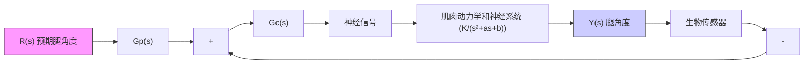
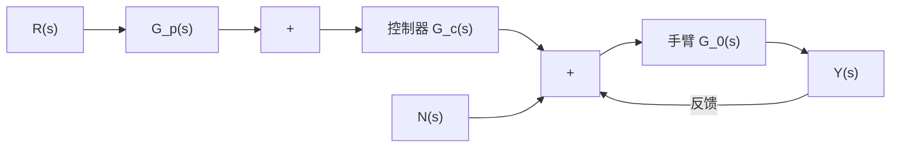

# 10-23 设被控对象为

$$G _ {0} (s) = \frac {1 0}{s ^ {2}}$$

试设计一个带有 PID 控制器和前置滤波器的单位负反馈控制系统,使系统的阶跃响应具有最优的 ITAE 指标,峰值时间为 0.8s 左右,并给出系统的单位阶跃响应曲线。

10-24 在太阳黑子活动的高峰期，NASA会把 $\gamma$ 射线图像设备(GRID)系于高空飞行的气球上，以从事长时间的观测实验。GRID设备能拍摄更准确的X射线的强度图，也可以拍摄 $\gamma$ 射线强度图。这些信息有利于在下一次太阳活动高峰期，对太阳中的高能现象进行研究。装配在气球上的GRID如图10-22(a)所示，其主要组成部分是：直径为 $5.2\mathrm{m}$ 的吊舱，GRID有效载荷，高空气球和连接气球与吊舱的缆绳。GRID设备指向控制系统如图10-22(b)所示。其中，扭矩电机负责驱动圆桶式吊舱装置。要求设计PID控制器 $G_{c}(s)$ 及前置滤波器 $G_{p}(s)$ ，使系统在阶跃输入作用下的稳态跟踪误差为零，并具有ITAE优化性能。

  
图 10-22 GRID 设备的指向控制系统

10-25 图 10-23 的模型描述了人类站立时的平衡调节机制。对于丧失自主站立能力的下

身残疾的伤残人士,需要安装图 10-23 所示的站立和腿关节人工控制系统。设计要求:

flowchart

图 10-23 站立和腿关节的人工控制系统

(1) 若肌肉-神经系统的参数标称值为 $K = 10, a = 12, b = 100$ ，试用 ITAE 优化法设计 PI 控制器 $G_{c}(s)$ 和前置滤波器 $G_{p}(s)$ ，使人工控制系统阶跃响应的 $\sigma \% < 10\%$ ， $e_{ss}(\infty) < 5\%$ ， $t_{s} < 2s$ ( $\Delta = 2\%$ )；  
(2) 当人疲乏时, 肌肉-神经系统的参数变化为 $K = 15, a = 8, b = 144$ , 试沿用在 (1) 中得到的 PI 控制器和前置滤波器, 检验系统的鲁棒性能, 绘出系统参数变化前后的单位阶跃响应曲线。

10-26 空间机器人的机械臂及其控制框图如图 10-24 所示。已知电机与机械臂构成的手臂传递函数为

$$G _ {0} (s) = \frac {1 0}{s (s + 1 0)}$$

natural_image

Illustration of a robotic arm with articulated joints and a handheld device (no text or symbols visible)

(a)

flowchart

(b)   
图 10-24 空间机器人的机械臂控制系统

设计要求：

(1) 当 $G_{c}(s)=K$ 时，确定 K 的合适取值，使系统阶跃响应的超调量 $\sigma\%=4.5\%$ ;  
(2) 采用 ITAE 优化方法, 并选取 $\omega_{n} = 10$ , 设计合适的 PD 控制器 $G_{c}(s)$ , 确定对应的前置滤 $\mathbb{F} G_{p}(s)$ ;  
(3) 采用 ITAE 优化方法, 设计合适的 PI 控制器 $G_{c}(s)$ 和相应的前置滤波器 $G_{p}(s)$ ;  
(4) 采用 ITAE 优化方法和 $\omega_{n}=10$ ，设计合适的 PID 控制器 $G_{c}(s)$ 和前置滤波器 $G_{p}(s)$ ;  
(5) 对上述各种设计效果, 列表比较系统对单位阶跃输入响应的 $\sigma\%$ , $t_p$ , $t_s$ ( $\Delta=2\%$ ), 以及由单位阶跃扰动引起的输出 $y(t)$ 的最大值和稳态值。
