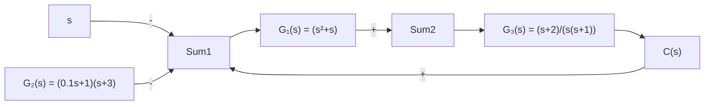

# 1. 控制系统建模

在控制系统的分析和设计中,首先要建立系统的数学模型。在 MATLAB 中,常用的系统建模方法有传递函数模型、零极点模型以及状态空间模型等。下面结合图 B-1,介绍这些建模方法。

flowchart

```mermaid
graph LR
    R["s"] --> | - | Sum1
    Sum1 --> G1["G₁(s) = (s²+s)"]
    G1 --> | + | Sum2
    Sum2 --> G3["G₃(s) = (s+2)/(s(s+1))"]
    G3 --> C["C(s)"]
    C --> | + | Sum1
    G2["G₂(s) = (0.1s+1)(s+3)"] --> | - | Sum1
```

图 B-1 控制系统
