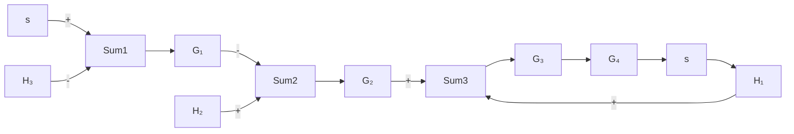

# (4) 综合应用: 结构图化简及其闭环传递函数的求取

例 B-1 已知多回路反馈系统的结构图如图 B-2 所示，求闭环系统的传递函数 $C(s)/R(s)$ 。其中， $G_{1}(s)=\frac{1}{s+10}, G_{2}(s)=\frac{1}{s+1}, G_{3}(s)=\frac{s^{2}+1}{s^{2}+4s+4}, G_{4}(s)=\frac{s+1}{s+6}, H_{1}(s)=\frac{s+1}{s+2}, H_{2}(s)=2, H_{3}(s)=1$ 。


<details>
<summary>flowchart</summary>


</details>

图 B-2 多回路反馈系统

解 MATLAB 程序: example1.m

$$G 1 = \operatorname{tf} ([ 1 ], [ 1 1 0 ]);\mathrm{G} 2 = \mathrm{tf} ([ 1 ], [ 1 1 ]);\mathrm{G} 3 = \mathrm{tf} ([ 1 0 1 ], [ 1 4 4 ]);$$

```matlab
numg4=[1 1];deng4=[1 6];G4=tf(numg4,deng4);
H1=zpk([-1],[-2],1);
numh2=[2];denh2=[1];H3=1; %建立各个方块子系统模型
nh2=conv(numh2,deng4);dh2=conv(denh2,numg4);
H2=tf(nh2,dh2); %先将 H₂ 移至 G₄ 之后
sys1=series(G3,G4);
sys2=feedback(sys1,H1,+1); %计算由 G₃,G₄ 和 H₁ 回路组成的子系统模型
sys3=series(G2,sys2);
sys4=feedback(sys3,H2); %计算由 H₂ 构成反馈回路的子系统模型
sys5=series(G1,sys4);
sys=feedback(sys5,H3) %计算由 H₃ 构成反馈主回路的系统闭环传递函数
```

在 MATLAB 中运行 M 文件 example1 后, 求得系统的闭环传递函数为

Zero/pole/gain:

0.083333 (s+1) $^{2}$ (s+2) (s $^{2}$ + 1)

$(s + 10.12)(s + 2.44)(s + 2.349)(s + 1)(s^2 + 1.176s + 1.023)$

式中，“\~”表示乘方运算。
