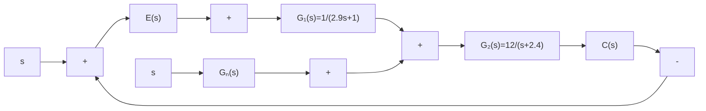

# (2) 综合运用(复合校正)

例 B-6 设系统结构图如图 B-12 所示。

flowchart

图 B-12 复合校正系统

1）当 $r(t) = 0, n(t) = 0.1\sin t$ 时，试分析扰动信号对系统输出的影响；  
2) 试设计校正环节 $G_{n}(s)$ , 使系统输出不受扰动 $n(t)$ 的影响, 并讨论校正环节的物理实现性。

解 由图 B-12 可知, 扰动作用下的系统传递函数为

$$\Phi_ {n} (s) = \frac {G _ {2} (s) [ 1 + G _ {1} (s) G _ {n} (s) ]}{1 + G _ {1} (s) G _ {2} (s)}$$

若选择前馈补偿装置的传递函数

$$G _ {n} (s) = - \frac {1}{G _ {1} (s)}$$

必有 $C(s) = E(s) = 0, G_n(s)$ 实现了对扰动误差的全补偿。然而，由于 $G_1(s)$ 的分母多项式次数一般总是大于或等于分子多项式次数， $G_n(s)$ 在物理上往往无法准确实现。因此在实际应用时，多在主要频段内采用近似全补偿，或者采用稳态全补偿。

MATLAB 程序: example6.m

G1=tf([1],[2.9 1]);
G2=tf([12],[1 2.4]); %建立系统框图模型
Gn=0;sysn0=(G2*(1+G1*Gn))/(1+G1*G2) %校正前的Φn(s)
t=0:0.01:20; %设定仿真时间为20s
u=0.1*sin(t); %扰动输入n(t)=0.1sint
figure(1)
lsim(sysn0,u,t,0);grid %绘制校正前扰动作用下的输出曲线
xlabel('t');ylabel('c(t)');
Gn=-1/G1;
sysn1=(G2*(1+G1*Gn))/(1+G1*G2); %全补偿校正后的Φn(s)
Gc=tf([1],[0.01 1]); Gn=-Gc/G1; %构造近似补偿环节
sysn2=(G2*(1+G1*Gn))/(1+G1*G2); %近似补偿校正后的Φn(s)
figure(2)
lsim(sysn2,u,t,0); grid; %绘制近似补偿后扰动作用下的输出曲线
xlabel('t');ylabel('c(t)');
%添加坐标说明

在 MATLAB 中运行 M 文件 example6 后, 结果如下:

1) 当扰动信号 $n(t)=0.1\sin t$ 单独作用时，系统稳态输出为图 B-13 所示的正弦信号，其最大振幅 $A_{m}=0.263$ ，对系统输出影响较大。  
2）当采用对扰动的误差全补偿时，补偿环节 $G_{n}(s) = -2.9s - 1$ 。由于 $G_{n}(s)$ 的分子次数高于分母次数，故不便于物理实现。可以考虑在主要频段内采用近似全补偿

$$G _ {n} (s) = - \frac {T _ {1} s + 1}{T _ {2} s + 1}, T _ {1} \gg T _ {2}$$

若取 $G_{n}(s) = -\frac{2.9s + 1}{0.01s + 1}$ ，扰动信号 $n(t) = 0.1\sin t$ 单独作用时的系统稳态输出如图B-14所示，由图可见，输出信号振幅被抑制到了相当小的范围，而且兼顾了物理实现性。

line

| t/s | c(t) - Solid Line | c(t) - Dotted Line |
| --- | --- | --- |
| 0 | 0.0 | 0.0 |
| 2 | 0.23 | 0.1 |
| 4 | -0.27 | -0.1 |
| 6 | 0.18 | 0.05 |
| 8 | 0.27 | 0.1 |
| 10 | -0.27 | -0.1 |
| 12 | 0.18 | 0.05 |
| 14 | 0.27 | 0.1 |
| 16 | -0.27 | -0.1 |
| 18 | 0.18 | 0.05 |
| 20 | 0.27 | 0.1 |

图 B-13 复合校正前扰动作用下输出

line

| t/s | c(t) |
| --- | --- |
| 0 | 0.0000 |
| 1 | 0.0800 |
| 2 | 0.0900 |
| 3 | 0.0700 |
| 4 | -0.0600 |
| 5 | -0.0900 |
| 6 | -0.0400 |
| 7 | 0.0800 |
| 8 | 0.0900 |
| 9 | 0.0700 |
| 10 | -0.0600 |
| 11 | -0.0900 |
| 12 | -0.0400 |
| 13 | 0.0800 |
| 14 | 0.0900 |
| 15 | 0.0700 |
| 16 | -0.0600 |
| 17 | -0.0900 |
| 18 | -0.0400 |
| 19 | 0.0800 |
| 20 | 0.1000 |

图 B-14 复合校正后扰动作用下输出
