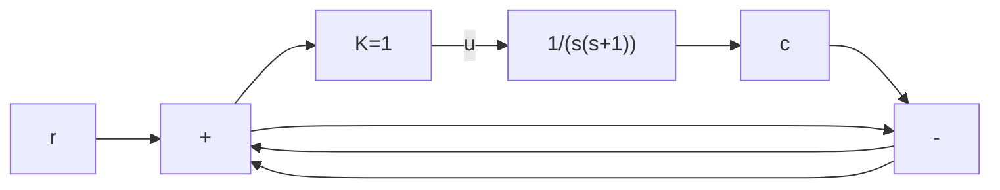

# (2) 综合运用(非线性系统的稳定性分析)

例 B-8 设系统如图 B-17 所示。试分别用描述函数法和相平面法判断系统的稳定性，并画出系统 $c(0) = -3, \dot{c}(0) = 0$ 的相轨迹和相应的时间响应曲线。

解 1) 描述函数法。非线性环节的描述函数为

$$N (A) = \frac {2}{\pi} \left[ \arcsin \frac {2}{A} + \frac {2}{A} \sqrt {1 - \left(\frac {2}{A}\right) ^ {2}} \right], \quad A \geqslant 2$$

在复平面内分别绘制线性环节的 $\Gamma_{G}$ 曲线和负倒描述函数 $-1/N(A)$ 曲线，由于 $G(s)$ 为线性环节

flowchart

图 B-17 饱和非线性系统

$$G (s) = - \frac {1}{N (A)}$$

利用频域奈氏判据可知，若 $\Gamma_G$ 曲线不包围 $-1 / N(A)$ 曲线，则非线性系统稳定；反之，则非线性系统不稳定。

MATLAB 程序: example8a.m

$$
\begin{array}{l} \mathrm{G} = \mathrm{zpk} ([ ], [ 0 - 1 ], 1); \quad \% \text {建立线性环节模型} \\ \text {nyquist} (G); \text {hold on} \% \text {绘制线性环节奈奎斯特曲线} \Gamma_ {G}, \text {图形保持} \\ \mathrm{A} = 2: 0. 0 1: 6 0; \quad \% \text {设定非线性环节输入信号振幅范围} \\ \mathrm{x} = \text { real } (- 1. / ((2 * (\text { asin } (2. / A) + (2. / A). * \text { sqrt } (1 - (2. / A). ^ {- 2}))) / \mathrm{pi} + \mathrm{j} * 0)); \\ \% \text{计算负倒描述函数实部} \\ \mathrm{y} = \operatorname{imag} (- 1. / ((2 * (\text { asin } (2. / \mathrm{A}) + (2. / \mathrm{A}). * \operatorname{sqrt} (1 - (2. / \mathrm{A}). ^ {- 2}))) / \mathrm{pi} + \mathrm{j} * 0)); \\ \% \text{计算负倒描述函数虚部} \\ \operatorname{plot} (x, y); \quad \% \text {绘制非线性环节的负倒描述函数} \\ \text {axis} ([ - 1. 5 0 - 1 1 ]); \text {hold off} \% \text {重新设置图形坐标，取消图形保持} \\ \end{array}
$$

在 MATLAB 中运行 M 文件 example8a, 作 $\Gamma_G$ 曲线和负倒描述函数 $-1/N(A)$ 曲线如图 B-18 所示。图中 $\Gamma_G$ 曲线不包围 $-1/N(A)$ 曲线。根据非线性稳定判据, 该非线性系统稳定。
