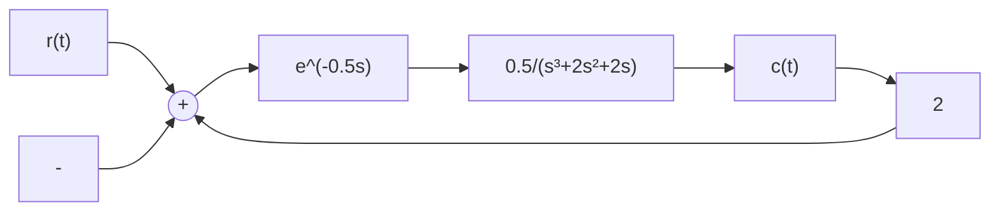

# (1) 综合运用(延迟系统的仿真)

例 B-12 设系统如图 B-26 所示, 试绘制该系统的单位阶跃响应曲线。

解 本题属于连续延迟系统的仿真问题,可以考虑在 Simulink 环境中按下列步骤进行:

flowchart

```mermaid
graph LR
    A["r(t)"] --> B((+))
    B --> C["e^(-0.5s)"]
    C --> D["0.5/(s³+2s²+2s)"]
    D --> E["c(t)"]
    E --> F["2"]
    F --> B
    G["-"] --> B
```

图 B-26 延迟系统
