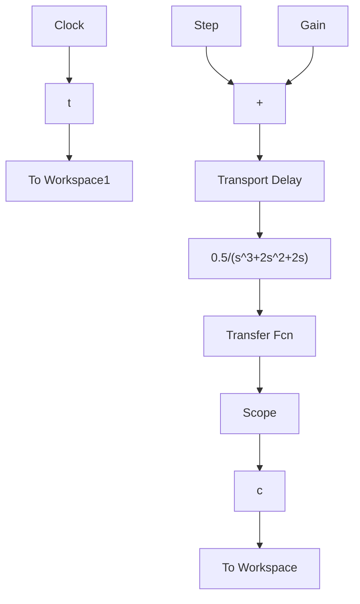

当然,用户也可以利用 Sinks(输出方式)子模型库中的 To Workspace 模块 simout 和 Sources (输入源)子模型库中的 Clock(时钟)模块 , 将仿真结果和仿真时间存到 MATLAB 的工作空间。双击 To Workspace 模块的图标,在如图 B-33 所示对话框 Variable name(变量名)引导的编辑框中分别输入自定义变量名 t,c,并将 Save format(数据存储形式)框选为 Array(列向量形式),再利用前面介绍的命令 plot(t,c)绘制图形,可对结果做进一步的处理。

⑥ 模块连接。各个模块参数设定以后，用鼠标先点一下起点模块的输出端(三角符号)，然后拖动鼠标，这时就会出现一条带箭头的直线，将箭头拉到终点模块的输入端再释放鼠标，两个模块就连接了起来。依此多次操作，建立系统模型如图 B-34 所示。

text_image

Block Parameters: To Workspace
To Workspace
Write input to specified array or structure in MATLAB's main workspace. Data is not available until the simulation is stepped or paused.
Parameters
Variable name:
Limit data points to last:
inf
Decimation:
1
Sample time (-1 for inherited):
-1
Save format: Array
OK    Cancel    Help    Apply

图 B-33 工作空间对话框

flowchart

图 B-34 Simulink 环境下的系统模型

2) 系统仿真。建立起系统模型以后，选择 Simulation|Simulation parameters 菜单，设定仿真控制参数。在其对话框的 Stop time(结束时间)编辑框中输入 20，即本题设定仿真时间为 20s，选择 OK 按钮完成仿真设定。然后选择 Simulation|Start 菜单选项或 ▶ 图标启动仿真，得到系统单位阶跃响应曲线如图 B-35 所示。
