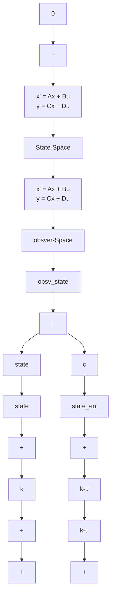

# (2) 综合运用(复杂系统仿真)

考虑控制系统状态空间分析部分的例 B-10。由于 Simulink 的 Continuous(连续环节)子模型库中含有一个 State-Space(状态空间)模块 $\begin{array}{l} x' = Ax + Bu \\ y = Cx + Du \end{array}$ ，利用该模块及设计结果，建立的复合系统模型如图 B-36 所示，并以 .mdl 格式保存。

若把状态空间表达式分解成状态变量方程组,也可按照例 B-12 的方法建立由各个子系统组成的复合系统模型,如图 B-37 所示。由图可见,对于本题,第二种方法搭建的过程十分烦琐,而实现的功能完全一致。因此下面仅介绍图 B-36 中各模块的参数设定方法。

双击图 B-36 上方的状态空间模块，在图 B-38 所示参数对话框 A, B, C 和 D 引导的编辑框中分别输入 $[-2 -2.5 -0.5; 1 0 0; 0 1 0]$ ， $[1; 0; 0]$ ，eye(3) 和 $[0; 0; 0]$ 。注意，矩阵要维数匹配，这样该模块输出的就是状态变量。另外由于 $x(0) = [1 -0.75 \quad 0.4]^{\mathrm{T}}$ ，可在 Initial conditions 引导的编辑框中输入 $[1 -0.75 \quad 0.4]$ ，选择 OK 按钮，即完成设置。

line

| Time of | Value |
| --- | --- |
| 0 | 0.0 |
| 5 | 0.6 |
| 10 | 0.45 |
| 15 | 0.5 |
| 20 | 0.48 |

图 B-35 系统阶跃响应示波器输出曲线

系统输出 y=cx，利用上述状态空间模块的输出，双击图 B-36 上方的增益模块，得到如图 B-39 所示的对话框，在 Gain 引导的编辑框中输入 $[1\quad4\quad3.5]$ ，并在 Multiplication 引导的框中选择 Matrix(K\*u)（矩阵乘方式，缺省为点乘），最后选择 OK 按钮，即完成设置。

flowchart

图 B-36 Simulink 环境下的复合系统模型
