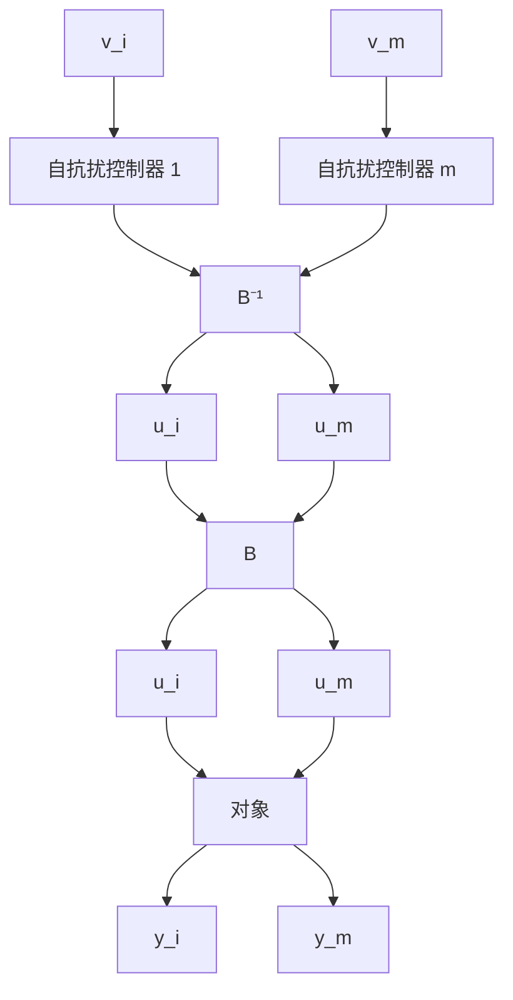

这样，在控制向量 U 和输出向量 y 之间并行地嵌入 m 个自抗扰控制器就能实现多变量系统的解耦控制。这时，实际的控制量 $u = \left[u_{1} u_{2} \cdots u_{m}\right]$ 就能由虚拟控制量 $U = \left[U_{1} U_{2} \cdots U_{m}\right]$ 用公式

$$\boldsymbol {u} = \boldsymbol {B} ^ {- 1} (x, \dot {x}, t) \boldsymbol {U} \tag {6.1.4}$$

决定出来.

有意思的是系统的动态耦合作用 $f(x,\dot{x},t)$ 的各分量 $f_{i}(x,\dot{x},t)$ ，在这个解耦控制中被当作各自通道上的总和扰动来被估计并补偿掉的。因此用自抗扰控制器进行解耦控制时，我们不去考虑“动态耦合”部分 $f(x,\dot{x},t)$ ，但是要用到“静态耦合”部分 $B(x,\dot{x},t)$ 。大量的仿真研究表明，用自抗扰控制器进行解耦控制时，对“静态耦合”矩阵 $B(x,\dot{x},t)$ 的估计精度要求不高，即使有百分之几十的估计误差，只要保证矩阵 $B(x,\dot{x},t)$ 的可逆性，对闭环的控制品质无多大影响。即使矩阵 $B(x,\dot{x},t)$ 在系统运行过程中瞬间地出现不可逆的奇异现象也关系不大，可以在矩阵 $B(x,\dot{x},t)$ 附近找一个可逆矩阵来近似就可以了。

flowchart

图6.1.1

例 对 $2 \times 2$ 耦合系统

$$
\left\{ \begin{array}{l} \ddot {x} _ {1} = x _ {1} ^ {2} + x _ {2} ^ {2} + \dot {x} _ {1} \dot {x} _ {2} + \operatorname{sign} (\sin (0. 9 t)) + b _ {1 1} (t) u _ {1} + b _ {1 2} (t) u _ {2} \\ \ddot {x} _ {2} = x _ {1} x _ {2} + \dot {x} _ {1} ^ {2} + \dot {x} _ {2} ^ {2} + \cos (0. 7 t) + b _ {2 1} (t) u _ {1} + b _ {2 2} (t) u _ {2} \\ y _ {1} = x _ {1} \\ y _ {2} = x _ {2} \end{array} \right. \tag {6.1.5}
$$

考察取不同的设定值 $y_{1}^{*}(t), y_{2}^{*}(t)$ 和不同的输入矩阵

$$
\boldsymbol {B} (t) = \left[ \begin{array}{l l} b _ {1 1} (t) & b _ {1 2} (t) \\ b _ {2 1} (t) & b _ {2 2} (t) \end{array} \right] \tag {6.1.6}
$$

时的控制效果.

设设定值和静态耦合矩阵——输入矩阵 B 的真值为

$$
\left\{ \begin{array}{l} y _ {1} ^ {*} (t) = 2, \quad y _ {2} ^ {*} (t) = 1 \\ \boldsymbol {B} _ {0} = \left[ \begin{array}{l l} 3 & 1 \\ 3 & 2 \end{array} \right], \Delta \boldsymbol {B} = \left[ \begin{array}{c c} 0. 5 \cos (t) & 0. 2 \sin (0. 8 t) \\ - 0. 6 \sin (0. 6 t) & 0. 5 \cos (0. 7 t) \end{array} \right] \\ \boldsymbol {B} (t) = \boldsymbol {B} _ {0} + \Delta \boldsymbol {B} = \left[ \begin{array}{l l} b _ {1 1} & b _ {1 2} \\ b _ {2 1} & b _ {2 2} \end{array} \right] \end{array} \right. \tag {6.1.7}
$$

这时 $\pmb{B}^{-1}(t) = \frac{1}{bb}\left[ \begin{array}{cc}b_{22} & -b_{12}\\ -b_{21} & b_{11} \end{array} \right],\mathrm{bb} = \operatorname *{det}(\pmb {B}),\pmb{B}_0^{-1} = \left[ \begin{array}{cc}\frac{2}{3} & -\frac{1}{3}\\ -1 & 1 \end{array} \right].$
