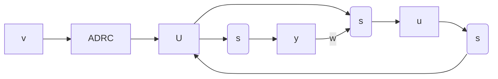

# 6.2 零极点配置设计方法

在2.6节2中已讨论过配置系统零点来与系统的已有极点相消，使系统的传递关系变成近似于1的闭环系统。下面一般地讨论在系统设计中采用系统零点结构配置办法来简化控制器设计的问题。

设有串级对象

$$y = w (s) u = \frac {1}{p _ {1} (s)} \frac {1}{p _ {2} (s)} u \tag {6.2.1}$$

其中假定多项式 $p_2(s)$ 确切知道．这时令

$$U = \frac {1}{p _ {2} (s)} u \tag {6.2.2}$$

为虚拟控制量,那么系统变成

$$y = \frac {1}{p _ {1} (s)} U \tag {6.2.3}$$

在这里,如果我们决定了虚拟控制量 $U(t)$ ,那么就有

$$u = p _ {2} (s) U \tag {6.2.4}$$

实际控制量 u 是由虚拟控制量 $U(t)$ 的各阶微分的组合来确定的.
至于虚拟控制量 $U(t)$ 是对系统

$$y = \frac {1}{p _ {1} (s)} U (t) \tag {6.2.5}$$

采用自抗扰控制器设计办法来确定(图6.2.1).

例1 设 $p_1(s) \equiv 1, p_2(s) = s^4 + 2s^3 + 3s^2 + 2s + 1$ ，是稳定多项式。设定值为 $v(t) \equiv 2$ 。这时

flowchart

图6.2.1

$$y = \frac {1}{p _ {2} (s)} u = U, u = p _ {2} (s) U \tag {6.2.6}$$

现在我们确定 $U(t)$ 是用四阶跟踪微分器来跟踪设定值 $v(t) \equiv 2$ 的过程曲线，那么这个四阶跟踪微分器就同时给出过程曲线 $U(t)$ 的一阶、二阶、三阶、四阶导函数，从而就可以确定出实际的控制量 $u = p_2(s)U.$ 跟踪设定值 $v(t) \equiv 2$ 的四阶跟踪微分器为

$$
\left\{ \begin{array}{l} f _ {0} = - r \left(r \left(r \left(v _ {1} - v (t)\right) + 4 v _ {2}\right) + 6 v _ {3}\right) + 4 v _ {4}) \\ v _ {1} = v _ {1} + h v _ {2} \\ v _ {2} = v _ {2} + h v _ {3} \\ v _ {3} = v _ {3} + h v _ {4} \\ v _ {4} = v _ {4} + h f _ {0} \\ U (t) = v _ {1} (t) \end{array} \right. \tag {6.2.7}
$$

当然有 $\frac{\mathrm{d}U}{\mathrm{d}t} = v_2(t),\frac{\mathrm{d}^2U}{\mathrm{d}t^2} = v_3(t),\frac{\mathrm{d}^3U}{\mathrm{d}t^3} = v_4(t),\frac{\mathrm{d}^4U}{\mathrm{d}t^4} = f_0$ ，因此就有

$$u = p _ {2} (t) U = f _ {0} + 2 v _ {4} + 3 v _ {3} + 2 v _ {2} + v _ {1} \tag {6.2.8}$$

原系统的离散状态变量实现为

$$
\left\{ \begin{array}{l} \mathrm{ff} = - x _ {1} - 2 x _ {2} - 3 x _ {3} - 2 x _ {4} \\ x _ {1} = x _ {1} + h x _ {2} \\ x _ {2} = x _ {2} + h x _ {3} \\ x _ {3} = x _ {3} + h x _ {4} \\ x _ {4} = x _ {4} + h (\mathrm{ff} + u) \\ y = x _ {1} \end{array} \right. \tag {6.2.9}
$$

控制的目的是让输出量(被控量) $y(t)$ 尽快而无超调地跟踪设定值 $v(t)\equiv2$ .按上述方法所作的具体仿真结果如图6.2.2所示.

line

| x | y (r=0.5) | y (r=1) | y (r=2) |
| --- | --- | --- | --- |
| 0 | 0 | 0 | 0 |
| 10 | 1 | 1 | 1 |
| 20 | 2 | 2 | 2 |
| 30 | 3 | 3 | 3 |
| 40 | 4 | 4 | 4 |
| 50 | 5 | 5 | 5 |
| 60 | 6 | 6 | 6 |
| 70 | 7 | 7 | 7 |
| 80 | 8 | 8 | 8 |
| 90 | 9 | 9 | 9 |
| 100 | 10 | 10 | 10 |

图6.2.2

如果多项式 $p_1(s) \neq 1$ ，是二阶多项式 $p_1(s) = s^2 + a_2s + a_1$ ，那么
