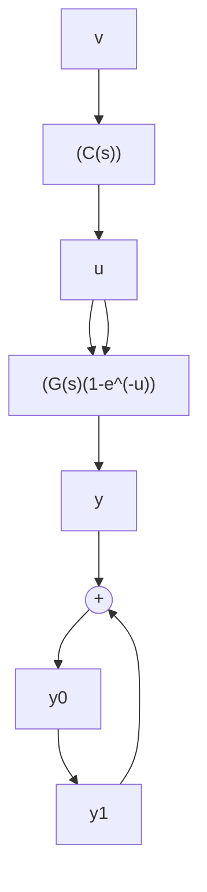

line

| x | y |
| --- | --- |
| 0 | 0.0 |
| 500 | 0.7 |
| 1000 | 0.7 |

line

| x | y1 | y2 |
| --- | --- | --- |
| 0 | 0.0 | 0.0 |
| 500 | 0.9 | 0.6 |
| 1000 | 1.0 | 0.6 |

line

| x | y1 | y2 |
| --- | --- | --- |
| 0 | 0.0 | 0.0 |
| 500 | 0.8 | 0.6 |
| 1000 | 1.0 | 0.7 |

图6.3.4  

flowchart

图6.3.5

使输入 $u$ 到新输出 $y_0$ 之间传递关系变成没有时滞，从而可用常规办法设计出使闭环稳定的控制器。那么把原输出 $y$ 改造成新输出 $y_0$ 的Smith预估法究竟是什么意思？

从信号 u 到 $y_{0}$ 的传递关系为

$$y _ {0} = y + y _ {1} = G (s) \mathrm{e} ^ {- \tau s} u + G (s) (1 - \mathrm{e} ^ {- \tau s}) u = G (s) u \tag {6.3.12}$$

现在我们把上式改写成

$$y _ {0} = y + y _ {1} = G (s) \mathrm{e} ^ {- r s} \left(1 + \frac {1 - \mathrm{e} ^ {- r s}}{\mathrm{e} ^ {- r s}}\right) u \tag {6.3.13}$$

那么由于

$$\left(1 + \frac {1 - \mathrm{e} ^ {- \tau s}}{\mathrm{e} ^ {- \tau s}}\right) = \frac {1}{\mathrm{e} ^ {- \tau s}} = \mathrm{e} ^ {\tau s} \approx 1 + \tau s \tag {6.3.14}$$

于是

$$
\begin{array}{l} y _ {0} = y + y _ {1} = G (s) \mathrm{e} ^ {- \tau s} (1 + \tau s) u = \\ (1 + \tau s) G (s) \mathrm{e} ^ {- \tau s} u = \\ y + \tau s y = \\ y + \tau \frac {\mathrm{d} y}{\mathrm{d} t} = y + y _ {1} \tag {6.3.15} \\ \end{array}
$$

最后一式明确表明 Smith“预估器”的含义: 新输出 $y_{0}$ 是对系统实际输出 y 加上用 y 的微分 sy 来外推 $\tau$ 时间预报的信号.

由于我们有滤波功能很强的跟踪微分器, 就有可能用微分预估法取代 Smith 预估法. 这里的基本思路就是用跟踪微分器先处理系统实际输出 y 来得到预估的新输出 $y_{0}$ . 然后对这个新输出量 $y_{0}$ 设计自抗扰控制器来完成时滞系统的控制. 于是可以给出如下典型算法

$$
\begin{array}{l} \mathrm{fh} = \text { fhan } (v _ {1} - v (t), v _ {2}, r _ {0}, h _ {0}) \\ v _ {1} = v _ {1} + h v _ {2} \\ v _ {2} = v _ {2} + h \mathrm{fh} \\ f _ {y} = \text { fhan } (y _ {1} - y, y _ {2}, r _ {1}, h) \\ y _ {1} = y _ {1} + h y _ {2} \\ y _ {2} = y _ {2} + h f _ {y} \\ y _ {0} = y _ {1} + \alpha_ {x} y _ {2} \\ e = z _ {1} - y _ {0} \\ z _ {1} = z _ {1} + h (z _ {2} + b _ {0} u) - \beta_ {0 1} e \\ z _ {2} = z _ {2} - \beta_ {0 2} e \\ e _ {1} = v _ {1} - z _ {1} \\ u = ((\beta_ {1} e _ {1} - z _ {2}) / b _ {0} \end{array} \tag {6.3.16}
$$
