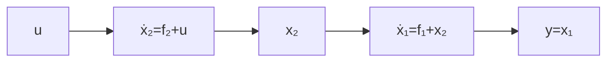

# 6.4 串级系统的自抗扰控制

设有二阶系统

$$
\left\{ \begin{array}{l} \dot {x} _ {1} = f _ {1} (x _ {1}) + x _ {2} \\ \dot {x} _ {2} = f _ {2} (x _ {1}, x _ {2}, t) + b u \\ y = x _ {1} \end{array} \right. \tag {6.4.1}
$$

式中假定 $x_{1}, x_{2}$ 均可量测， $f_{2}(x_{1}, x_{2}, t)$ 是未知函数。

所谓串级系统的意思是控制量 $u$ 直接驱动 $x_{2}$ ，而 $x_{2}$ 再去直接驱动 $x_{1}$ 来达到控制目的。用框图表示为图6.4.1。

flowchart

图6.4.1

在此我们把状态变量 $x_{2}$ 当作控制状态变量 $x_{1}$ 的“虚拟控制量” $U_{1}$ .

至于函数 $f_{1}(x_{1})$ 可分两种情形：① $f_{1}(x_{1})$ 确知的情形；② $f_{1}(x_{1})$ 未知的情形．控制的目的，是让 $x_{1}$ 跟踪实时可测的时变轨迹 $\pmb {v}(t)$

对前一种情形，如果函数 $f_{1}(x_{1})$ 确知．先对虚拟控制量进行确知函数 $f_{1}(x_{1})$ 的补偿 $U=U_{0}-f_{1}(x_{1})$ ，使第一式变成 $x_{1}=U_{0}$ ，然后用误差反馈来设计 $U_{0}$ 使变量 $x_{1}$ 跟踪时变轨迹 $v(t)$ 。这样确定了虚拟控制量 $U(t)$ 之后，把它当作状态变量 $x_{2}$ 要跟踪的“目标轨迹”，从而在变量 $x_{2}$ 和实际控制量u之间设计自抗扰控制器让 $x_{2}$ 跟踪前面确定的虚拟控制量 $U(t)$ 来完成最终的控制目的。

对后一种情形，当函数 $f_{1}(x_{1})$ 未知或含有不确定因素时，根据设定轨迹 $v(t)$ 用自抗扰控制器来生成虚拟控制量 $U(t)$ ，然后把它当作状态变量 $x_{2}$ 要跟踪的“目标轨迹”，从而在第二式中可以设计实际控制量 $u(t)$ 了. 这就是解决串级系统控制问题的基本思路.

一般的,也可以解决多级串联型系统的控制问题.如对系统

$$
\left\{ \begin{array}{l} \dot {x} _ {1} = f _ {1} + x _ {2} \\ \dot {x} _ {2} = f _ {2} + x _ {3} \\ \vdots \\ \dot {x} _ {n - 1} = f _ {n - 1} + x _ {n} \\ \dot {x} _ {n} = f _ {n} + u \end{array} \right. \tag {6.4.2}
$$

中假定所有状态变量 $x_{1}, x_{2}, \cdots, x_{n}$ 都能够量测。我们把状态变量 $x_{2}, x_{3}, \cdots, x_{n}$ 依次当作控制状态变量 $x_{1}, x_{2}, \cdots, x_{n-1}$ 的“虚拟控制量” $U_{1}, U_{2}, \cdots, U_{n-1}$ ，然后依次决定虚拟控制量 $U_{i}$ ，即把 $x_{i+1}$ 当作控制状态变量 $x_{i}$ 的虚拟控制量 $U_{i}$ 。一旦确定了这个虚拟控制量 $U_{i}$ ，就把它当作状态变量 $x_{i+1}$ 要跟踪的“目标轨线”。这样依次下去最后可确定出实际控制量 u 了。当函数 $f_{1}, f_{2}, \cdots, f_{n-1}$ 确知时用简单的补偿与简单的误差反馈法，而函数 $f_{1}, f_{2}, \cdots, f_{n-1}$ 未知或含有不确定因素时要用自抗扰控制器，即把状态变量 $x_{i+1}$ 当作控制状态变量 $x_{i}$ 的“虚拟控制量” $U_{i}(t)$ ，同时又把 $U_{i}(t)$ 当作状态变量 $x_{i+1}$ 要跟踪的“目标轨迹”来设计下一个 $U_{i+1}(t)$ 。最后设计实际的控制量 $u(t)$ 。在这个过程中每一次只设计一阶对象的控制器，即把 n 阶对象的控制问题化成 n 一个阶对象的控制问题来解决。现代控制理论中的所谓“back-stepping”方法，其基本思想是与上述方法一致，但在每一步的具体处理方法上大有区别。这里的每一步是简单的补偿和误差反馈，或一阶自抗扰控制方法，但“back-stepping”方法是一步步递推构造复杂的 Lyapunov 函数的办法来设计控制器的。

例1 设有系统
