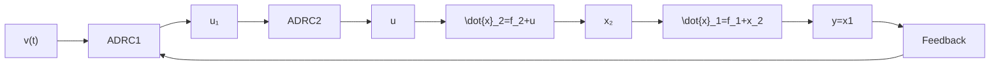

| x | y1 | y2 |
| --- | --- | --- |
| 0 | 0.5 | - |
| 2 | 1.0 | - |
| 4 | 1.5 | - |
| 6 | 1.8 | - |
| 8 | 2.0 | - |
| 10 | 2.2 | - |
| 12 | 2.3 | - |
| 14 | 2.4 | - |
| 16 | 2.5 | - |
| 18 | 2.6 | - |
| 20 | 2.7 | - |
| 2 | 0.5 | - |
| 4 | 1.0 | - |
| 6 | 1.5 | - |
| 8 | 1.8 | - |
| 10 | 2.0 | - |
| 12 | 2.2 | - |
| 14 | 2.3 | - |
| 16 | 2.4 | - |
| 18 | 2.5 | - |
| 20 | 2.6 | - |
The chart displays two subplots: the top plot shows y1 (logarithmic scale) versus x (linear scale), and the bottom plot shows y2 (signal function) versus x (time scale). The y1 values are constant at approximately 2.5 for all x > 0, while y2 values are constant at approximately -10 for x < 0 and +10 for x > 0. The y2 values are constant at approximately -10 for x < 0 and +10 for x > 0. The y1 and y2 values are constant at approximately 2.5 for x ≥ 0, indicating that the signal is constant at the same time step but constant at the initial value of y1. The y2 values are constant at the initial value of y2, which remains constant across all x values. The label 'w' in the bottom subplot indicates the sign of the sine wave function w = sign(sin(0.5r)).

图6.4.2

整个控制算法为

$$
\left\{ \begin{array}{l} v _ {1} = v _ {1} - h r _ {0} \mathrm{fal} (v _ {1} - v, 0. 5, h) \\ e = z _ {1 1} - y, \mathrm{fe} = \mathrm{fal} (e, 0. 5, h) \\ z _ {1 1} = z _ {1 1} + h \left(z _ {1 2} - 1 0 0 e + u _ {1}\right) \\ z _ {1 2} = z _ {1 2} + h (- 3 0 0 \mathrm{fe}) \\ e _ {1} = v _ {1} - z _ {1 1} \\ u _ {1} = \beta_ {1} \mathrm{fal} \left(e _ {1}, \alpha_ {1}, \delta_ {1}\right) - z _ {1 2} \\ e = z _ {2 1} - x _ {2}, \mathrm{fe} = \mathrm{fal} (e, 0. 5, h) \\ z _ {2 1} = z _ {2 1} + h \left(z _ {2 2} - 1 0 0 e + u\right) \\ z _ {2 2} = z _ {2 2} + h (- 3 0 0 \mathrm{fe}) \\ e _ {2} = u _ {1} - z _ {2 1} \\ u = \beta_ {2} \mathrm{fal} \left(e _ {2}, \alpha_ {2}, \delta_ {2}\right) - z _ {2 2} \end{array} \right. \tag {6.4.7}
$$

这个过程用框图表示为图 6.4.3.

例 2 对上一个例子的第一式加上不确定项 $w(t) = \gamma_{0} \sin(\omega t)$

flowchart

图6.4.3

$$
\left\{ \begin{array}{l} \dot {x} _ {1} = x _ {1} ^ {2} + \gamma_ {0} \sin (\omega t) + x _ {2} \dots 1 \\ \dot {x} _ {2} = \gamma \text { sign } \left(\sin \left(\frac {t}{2}\right)\right) + u \dots 2 \\ y = x _ {1} \dots \dots 3 \end{array} \right. \tag {6.4.8}
$$

取对象参数为 $\omega = 0.3, \gamma_{0} = 5.0, \gamma = 10.0$ ，而控制器参数取成
