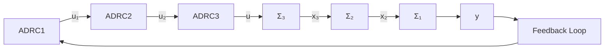

$$
\left\{ \begin{array}{l l} e = z _ {3 1} - x _ {3}, \mathrm{fe} = \operatorname{fal} (e, 0. 5, h) \\ z _ {3 1} = z _ {3 1} + h (z _ {3 2} - \beta_ {0 1} e + u) \\ z _ {3 2} = z _ {3 2} - h \beta_ {0 2} \mathrm{fe} \quad \text { 关于 } x _ {3} \text { 的扩张状态观测器 } \\ e _ {3} = u _ {2} - z _ {3 1} \quad \text { 生成误差 } \\ u = \beta_ {3} \operatorname{fal} (e _ {3}, 0. 5, 1. 0) - z _ {3 2} \quad \text { 误差反馈和扰动补偿 } \end{array} \right. \tag {6.4.12}
$$

对系统(6.4.9)设计三个一阶自抗扰控制器——ADRC1、ADRC2、ADRC3,其连接结构如图6.4.5所示.在这里,设计控制器 ADRC1 时, 我们把从虚拟控制量 $u_{1}$ 到变量 $x_{2}$ 的传递关系当作 “1” 来看待; 而设计控制器 ADRC2 时是把从虚拟控制量 $u_{2}$ 到变量 $x_{3}$ 的传递关系当作 “1” 来看待; 最后设计控制器 ADRC3 是让变量 $x_{3}$ 尽可能好地跟踪已确定的虚拟控制量 $u_{2}$ .

flowchart

图 6.4.5

对上述三阶对象(6.4.9)取控制器参数

$$\beta_ {0 1} = 1 0 0, \beta_ {0 2} = 3 0 0, r _ {0} = 1, \beta_ {1} = 4. 0, \beta_ {2} = 6 0. 0, \beta_ {3} = 5 0 0. 0$$

来所做的仿真结果如图6.4.6所示.

line

| X | W1 | W2 |
| --- | --- | --- |
| 0 | -10 | -15 |
| 2 | -10 | -15 |
| 4 | -10 | -15 |
| 6 | -5 | -10 |
| 8 | -5 | -10 |
| 10 | -5 | -10 |
| 12 | -5 | -10 |
| 14 | -5 | -10 |
| 16 | -5 | -10 |
| 18 | -5 | -10 |
| 20 | -5 | -10 |

图6.4.6

把对象扰动改成

$$w _ {1} (t) = 2 0 \text { sign } (\sin (0. 5 t)), w _ {2} (t) = 1 0 0 \text { sign } (\sin (1. 0 t)),w _ {3} (t) = 1 0 0 \text { sign } (\sin (1. 5 t))$$

但控制器参数不变所作的仿真结果如图6.4.7所示.这说明这样

line

| Time (s) | v | w | M |
| --- | --- | --- | --- |
| 1 | -15 | -10 | -10 |
| 2 | -10 | -5 | -5 |
| 3 | -5 | 0 | 0 |
| 4 | 0 | 5 | 5 |
| 5 | 5 | 10 | 10 |
| 6 | 10 | 15 | 15 |
| 7 | 15 | 20 | 20 |
| 8 | 20 | 25 | 25 |
| 9 | 25 | 30 | 30 |
| 10 | 30 | 35 | 35 |
| 11 | 35 | 40 | 40 |
| 12 | 40 | 45 | 45 |
| 13 | 45 | 50 | 50 |
| 14 | 50 | 55 | 55 |
| 15 | 55 | 60 | 60 |
| 16 | 60 | 65 | 65 |
| 17 | 65 | 70 | 70 |
| 18 | 70 | 75 | 75 |
| 19 | 75 | 80 | 80 |
| 20 | 80 | 85 | 85 |

图6.4.7

设计的控制器对对象不确定模型的鲁棒性特别强.

进一步,对于二阶的串级系统

$$
\left\{ \begin{array}{l} \ddot {x} _ {1} = f _ {1} (x _ {1}, \dot {x} _ {1}, x _ {2}, \dot {x} _ {2}, w _ {1}) + x _ {2} \\ \ddot {x} _ {2} = f _ {2} (x _ {1}, \dot {x} _ {1}, x _ {2}, \dot {x} _ {2}, w _ {2}) + u \\ y = x _ {1} \end{array} \right. \tag {6.4.13}
$$
