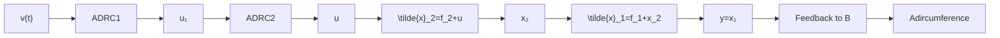

假定变量 $x_{1}$ 是被控输出，希望实施控制让 $x_{1}$ 跟踪设定轨迹 $\pmb{v}(t)$ 状态变量 $x_{1}, x_{2}$ 可量测.

在此,我们把变量 $x_{2}$ 当作控制被控输出 $x_{1}$ 的“虚拟控制量” $u_{1}$ ,然后用实际控制量 u 来控制中间变量 $x_{2}$ 让它跟踪上面确定的“虚拟控制量” $u_{1}$ ,以此来完成实际控制量 u 来控制被控输出 $y = x_{1}$ 的目的(图 6.4.8).

flowchart

图6.4.8

这时，“外环” $(y = x_{1}$ 要跟踪目标轨线 $v(t)$ 来确定控制量 $u_{1}$ 的自抗扰控制算法为

$$
\left\{ \begin{array}{l} \mathrm{fh} = \text { fhan } (v _ {1} - v, v _ {2}, r _ {0}, h) \\ v _ {1} = v _ {1} + h v _ {2} \\ v _ {2} = v _ {2} + h \mathrm{fh} \\ e = z _ {1 1} - x _ {1 1}, \mathrm{fe} = \text { fal } (e, 0. 5, h), \mathrm{fe} _ {i} = \text { fal } (e, 0. 2 5, h) \\ z _ {1 1} = z _ {1 1} + h (z _ {1 2} - \beta_ {0 1} e) \\ z _ {1 2} = z _ {1 2} + h (z _ {1 3} - \beta_ {0 2} \mathrm{fe} + u _ {1}) \\ z _ {1 3} = z _ {1 3} + h (- \beta_ {0 3} \mathrm{fe} _ {1}) \\ e _ {1} = v _ {1} - z _ {1 1}, e _ {2} = v _ {2} - z _ {1 2}, u _ {0} = \text { fhan } (e _ {1}, c _ {1} e _ {2}, r _ {1}, h _ {1}) \\ u _ {1} = u _ {0} - z _ {1 3} \end{array} \right. \tag {6.4.14}
$$

而“内环”（控制变量 $x_{2}$ 要跟踪虚拟控制量 $u_{1}$ ）的自抗扰控制算法

为

$$
\left\{ \begin{array}{l} e = z _ {2 1} - x _ {2}, \mathrm{fe} = \operatorname{fal} (e, 0. 5, h), \mathrm{fe} _ {1} = \operatorname{fal} (e, 0. 2 5, h) \\ z _ {2 1} = z _ {2 1} + h \left(z _ {2 2} - \beta_ {0 1} e\right) \\ z _ {2 2} = z _ {2 2} + h \left(z _ {2 3} - \beta_ {0 2} \mathrm{fe} + u\right) \\ z _ {2 3} = z _ {2 3} + h \left(- \beta_ {0 3} \mathrm{fe} _ {1}\right) \\ e _ {1} = u _ {1} - z _ {2 1}, e _ {2} = - z _ {2 2}, u _ {0} = \operatorname{fhan} \left(e _ {1}, c _ {2} e _ {2}, r _ {2}, h _ {2}\right) \\ u = u _ {0} - z _ {2 3} \end{array} \right. \tag {6.4.15}
$$

为了让这个“内外环”形式控制方法取得更好的效果，设计外环控制器ADRC1时，尽可能让其输出 $u_{1}$ 变化缓慢平滑一些，而设计内环控制器ADRC2的目的是让变量 $x_{2}$ 尽可能好地实现外环给出的虚拟控制量 $u_{1}$ ，因此在内环控制器ADRC2中取消了安排过渡过程的部分.

例4 设有两个串联的二阶系统

$$
\left\{ \begin{array}{l} \ddot {x} _ {1} = \gamma_ {1} \text {sign} (\sin (\omega_ {1} t)) + x _ {2} = f _ {1} (t) + x _ {2} \\ \ddot {x} _ {2} = \gamma_ {2} \text {sign} (\cos (\omega_ {2} t)) + u = f _ {2} (t) + u \end{array} \right. \tag {6.4.16}
$$

式中系统参数 $\gamma_{1}, \gamma_{2}, \omega_{1}, \omega_{2}$ 均未知，变量 $x_{1}, x_{2}$ 可量测，控制目标为让 $x_{1}$ 跟踪预先未知但实时能测得到的时变轨迹 $v(t) = \cos(t)$ . 把系统(6.4.17) 改写成
