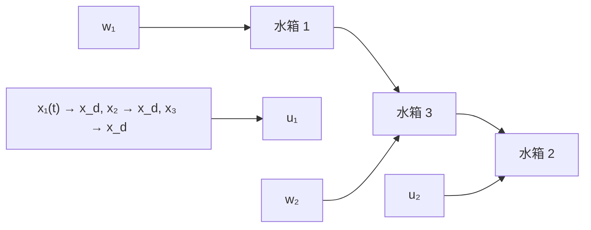

图 6.4.9 中上面是目标轨线和系统响应, 中间和下面分别是 $f_{1}(t)$ 和 $f_{2}(t)$ 及其估计 $z_{13}(t)$ 和 $z_{23}(t)$ .

$$
\left\{ \begin{array}{l} f _ {1} \left(x _ {1 1}, x _ {1 2}, x _ {2 1}, x _ {2 2}, t\right) = x _ {1 1} + x _ {1 2} + \operatorname{sign} (\sin (0. 3 t)) \\ f _ {2} \left(x _ {1 1}, x _ {1 2}, x _ {2 1}, x _ {2 2}, t\right) = x _ {2 1} + x _ {2 2} + 1 0 \operatorname{sign} (\cos (0. 2 t)) \end{array} \right. \tag {6.4.20}
$$

控制器与前面完全相同来进行仿真的结果如图6.4.10所示.这说明上述控制方法是可行且很有效的.

这些串级的被控对象，一般内环系统的“时间尺度”比外环系统的“时间尺度”小一些，即内环的运动变化比外环运动的变化还快，因此作数字计算时“内环”和“外环”应该采用不同的采样步长，即对应于内环的采样步长 $h_{1}$ 比对应于外环的采样步长 $h_{2}$ 要小 $(h_{1}<h_{2})$ 。这样作是能够避免上述例子中出现的高频颤震现象。但是为了方便，最好取成 $h_{2}=kh_{1}$ （k为正整数）。

例5 三水箱水位控制问题．其结构图如图6.4.11所示，图中 $u_{1}, u_{2}$ 分别为1号、2号水箱的供水量，是系统的两个相互独立的控制量, $w_{1},w_{2}$ 分别为1号、2号水箱的漏水量,是系统的扰动量.控制的目的是把三个水箱的水位都控制到同一个设定的水位 $x_{d}$ 上保持不变.如果假定三个水箱的规格相同,则把三个水箱的实际水位 $x_{1},x_{2},x_{3}$ 作为三个状态变量,那么这个系统的数学模型可描述为

line

| Time (s) | Signal Amplitude (dB) |
| --- | --- |
| 0 | 0 |
| 5 | 0 |
| 10 | 0 |
| 15 | 0 |
| 20 | 0 |
| 25 | 0 |
| 30 | 0 |
| 35 | 0 |
| 40 | 0 |

图 6.4.10

$$
\left\{ \begin{array}{l} \dot {x} _ {1} = - a \sqrt {\left| x _ {1} - x _ {3} \right|} + w _ {1} (t) + b u _ {1} \\ \dot {x} _ {2} = - a \sqrt {\left| x _ {2} - x _ {3} \right|} - A \sqrt {2 g \left| x _ {2} \right|} + w _ {2} (t) + b u _ {2} \\ \dot {x} _ {3} = a \sqrt {\left| x _ {1} - x _ {3} \right|} + a \sqrt {\left| x _ {2} - x _ {3} \right|} \end{array} \right. \tag {6.4.21}
$$

flowchart

图6.4.11

在这里，3号水箱的水位是由1号、2号水箱的水压来决定的。现在我们把1号、2号水箱对3号水箱的总的贡献当作对3号水箱的虚拟控制量 $U$ ，那么按模型

$$\dot {x} _ {3} = U$$

根据让 $x_{3}$ 达到设定值 $x_{d}$ 的要求, 很容易决定出虚拟控制量 U, 如取

$$U = \frac {0 . 1 7 5}{\gamma} \pi \mathrm{sin} \Big (\frac {\pi}{\gamma} t \Big) \frac {1 - \mathrm{sign} (t - \gamma)}{2} \text {或} U = \beta \mathrm{fal} (x _ {d} - x _ {3}, \alpha , \delta) \tag {6.4.22}$$

那么按第一种方式取的 $U(t)$ 其积分就是 $x_{3}(t)$ 从初值0.1出发 $\gamma$ 时间内到达设定值0.7的过程．由于有

$$a _ {1} \sqrt {\left| x _ {1} - x _ {3} \right|} + a _ {2} \sqrt {\left| x _ {2} - x _ {3} \right|} = U \tag {6.4.23}$$

又由于1号,2号水箱对3号水箱的贡献是均等的,因此可以令
