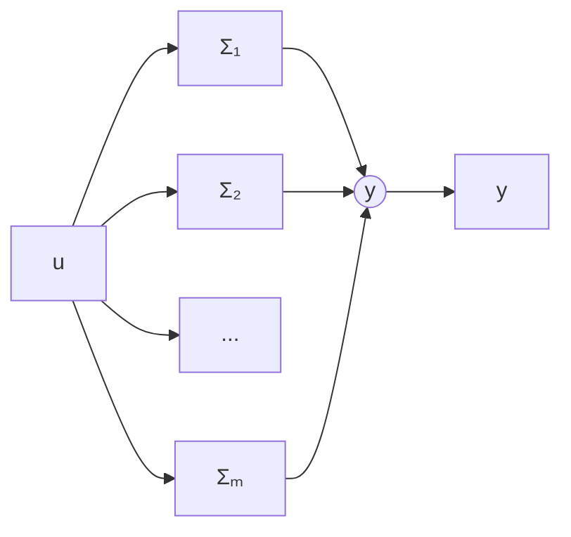

# 6.6 并联系统的自抗扰控制

如下结构系统(图 6.6.1) 称为并联性系统

flowchart

图6.6.1

在柔性臂减震控制问题的数学模型可归结为如下并联系统

$$
\left\{ \begin{array}{l} \ddot {x} _ {1} = f _ {1} \left(x _ {1}, \dot {x} _ {1}\right) + b _ {1} u \\ \ddot {x} _ {2} = f _ {2} \left(x _ {2}, \dot {x} _ {2}\right) + b _ {2} u \\ \vdots \\ \ddot {x} _ {m} = f _ {m} \left(x _ {m}, \dot {x} _ {m}\right) + b _ {m} u \\ y = x _ {1} + x _ {2} + \dots + x _ {m} \end{array} \right. \tag {6.6.1}
$$

系统输出 $y = x_{1} + x_{2} + \cdots + x_{m}$ 是被控量。现在以这个被控量 y 作为基本状态变量来重新建立系统模型得

$$
\left\{ \begin{array}{l} \ddot {y} = f (y, \dot {y}) + w (x, \dot {x}) + b u \\ x = x _ {1} + x _ {2} + \dots + x _ {m} \\ b = b _ {1} + b _ {2} + \dots + b _ {m} \end{array} \right. \tag {6.6.2}
$$

其中， $f(y,\dot{y})$ 和 b 作为已知函数和参数， $w(x,\dot{x})$ 作为未知扰动，设计自抗扰控制器来进行控制。

例如

$$
\left\{ \begin{array}{l} \ddot {x} _ {1} = - \omega_ {1} ^ {2} x _ {1} - 2 \xi_ {1} \omega_ {1} \dot {x} _ {1} + b _ {1} u \\ \ddot {x} _ {2} = - \omega_ {2} ^ {2} x _ {2} - 2 \xi_ {2} \omega_ {2} \dot {x} _ {2} + b _ {2} u \\ \vdots \\ \ddot {x} _ {\mathrm{m}} = - \omega_ {\mathrm{m}} ^ {2} x _ {\mathrm{m}} - 2 \xi_ {\mathrm{m}} \dot {x} _ {\mathrm{m}} + b _ {\mathrm{m}} u \\ y = x _ {1} + x _ {2} + \dots + x _ {\mathrm{m}} \end{array} \right. \tag {6.6.3}
$$

此系统可以改写成

$$
\left\{ \begin{array}{l} \ddot {x} _ {1} = - \omega_ {0} ^ {2} x _ {1} - 2 \xi_ {0} \omega_ {0} \dot {x} _ {1} + b _ {1} u - \left(\omega_ {1} ^ {2} - \omega_ {0} ^ {2}\right) x _ {1} - 2 \left(\xi_ {1} \omega_ {1} - \xi_ {0} \omega_ {0}\right) \dot {x} _ {1} \\ \ddot {x} _ {2} = - \omega_ {0} ^ {2} x _ {2} - 2 \xi_ {0} \omega_ {0} \dot {x} _ {2} + b _ {2} u - \left(\omega_ {2} ^ {2} - \omega_ {0} ^ {2}\right) x _ {2} - 2 \left(\xi_ {2} \omega_ {2} - \xi_ {0} \omega_ {0}\right) \dot {x} _ {2} \\ \vdots \\ \ddot {x} _ {m} = - \omega_ {0} ^ {2} x _ {m} - 2 \xi_ {0} \omega_ {0} \dot {x} _ {m} + b _ {m} u - \left(\omega_ {m} ^ {2} - \omega_ {0} ^ {2}\right) x _ {m} - 2 \left(\xi_ {m} - \xi_ {0} \omega_ {0}\right) \dot {x} _ {m} \\ y = x _ {1} + x _ {2} + \dots + x _ {m} \end{array} \right. \tag {6.6.4}
$$

把各项加起来,有
