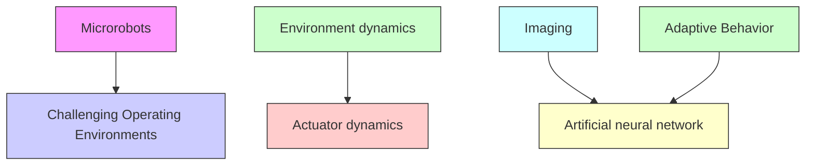

In this work, we demonstrate that deep reinforcement learning based on the Soft Actor Critic algorithm [46] can be used to create smart soft helical magnetic microrobots that autonomously learn optimized swimming behaviors when actuated with nonuniform, nonlinear, and time-varying magnetic fields in a physical fluid environment. Our RL microrobots learned successful actuation policies without any a priori knowledge about the dynamics of the microrobot, the electromagnetic actuator, or the environment (Figure 1a). These results demonstrate the potential of reinforcement learning for developing high performance multi-input, multi-output (MIMO) controllers for microrobots without the need for explicit system modeling. This capability to autonomously learn modelfree microrobot control algorithms could significantly reduce the time and resources required to develop high performance microrobotic systems [33].

(a)   

flowchart

flowchart

