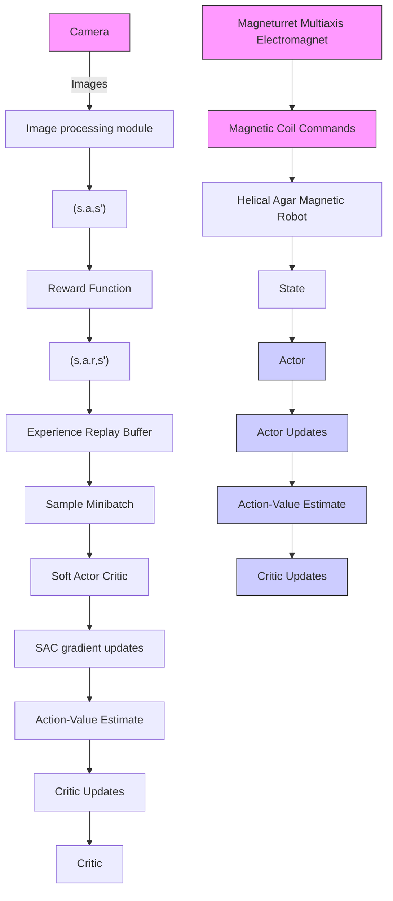

Figure 1. Microrobots with unknown dynamics in uncharacterized environments can be controlled with deep reinforcement learning. (a) Microrobotic systems are designed with a great variety of shapes, sizes, materials, and actuation methods, and are often operated in challenging environments. Controllers based on artificial deep neural networks trained with reinforcement learning (RL) can factor in all of these complex dynamic systems and inputs to create model-free microrobot controllers to create adaptive microrobots. (b) Our microrobotic system consisted of a helical agar magnetic robot (HAMR) in a circular polydimethylsiloxane (PDMS) fluidic track that was given the task of moving to a target position along the track under control of a multi-axis electromagnet (Magneturret). Images of the HAMR in the arena were captured with an overhead camera. (c) The smart microrobot control system used a neural network trained with the Soft Actor Critic (SAC) reinforcement learning algorithm to generate commands for the Magneturret. In the control loop, the stream of images from the overhead camera was processed to generate state information that was then fed into the actor neural network, which returned a set of continuous actions that were used to control the currents in the Magneturret. State (s), action (a), reward (r), and next state (s’) information was stored in a replay buffer which was used update actor and critic neural networks off policy in a learning loop.
