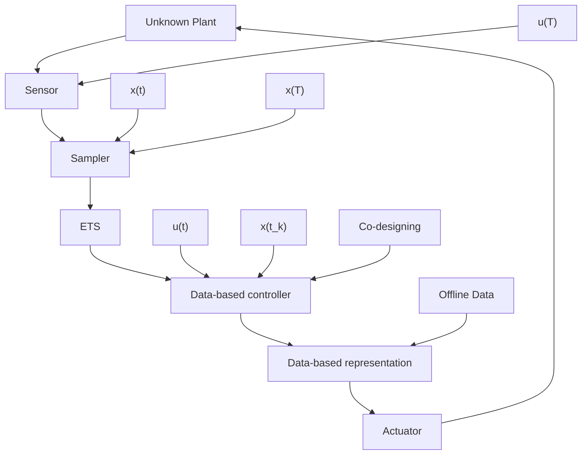
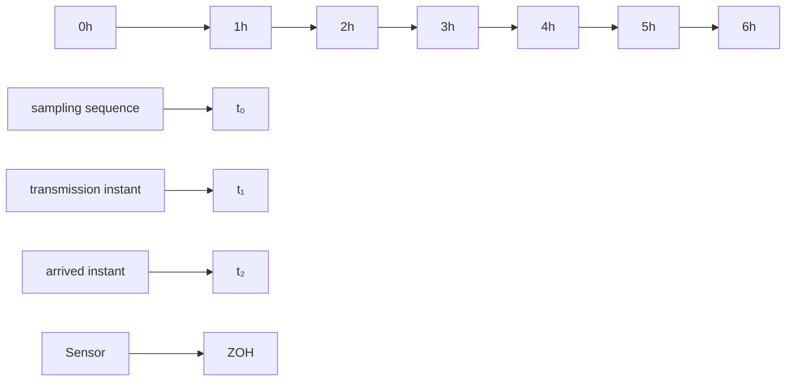

Note that, in Fig. 1, data are collected offline in an open-loop experiment. In online closed-loop operation, the system state is sampled and transmitted to the controller at time $t _ { k } \in \mathbb { N }$ , where $t _ { 0 } = 0 , t _ { k + 1 } - t _ { k } \ge 1$ , k ∈ N. In the controller, the sampled state $x ( t _ { k } )$ is available, and the control input is computed via the linear state-feedback law $u ( t _ { k } ) = K x ( t _ { k } )$ (and it is held constant until $t _ { k + 1 } - 1 )$ , where K is the controller gain matrix to be designed. The system (1) under the closed-loop sampled-data control can be written as

$$x (t + 1) = A x (t) + B K x (t _ {k}), \quad t \in \mathbb {N} _ {[ t _ {k}, t _ {k + 1} - 1 ]}. \tag {5}$$

Traditional periodic transmission schemes have been used for data-driven control, e.g., by [24], [25], [28], which determine the maximum sampling interval for which stability can be guaranteed. Avoiding “redundant” transmissions in networks, we develop a model-based ETS and STS for system (5) to adaptively determine the transmission instant $t _ { k }$ to save communication resources. Subsequently, we provide methods for data-driven co-design of ETS/STS and the corresponding controller based on the model-based stability conditions, where Lemma 1 is employed to describe the system matrices consistent with the data. The recent paper [26] addresses datadriven event-triggered control for continuous-time systems. In contrast, in the present paper, we address discrete-time systems and event-triggered as well as self-triggered control.

flowchart

Fig. 1. Structure of data-driven sampled-data systems under ETS.

flowchart

Fig. 2. Evolution of sampling and transmission events.
