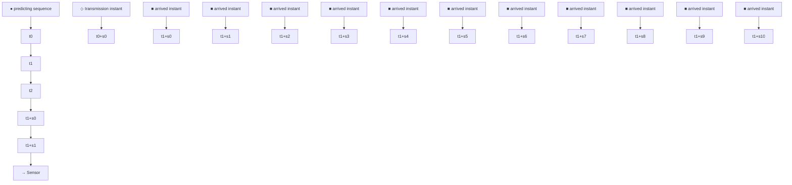

# A. Model-based STS

In order to apply data-driven control arguments similar to those in Section III, we first need to define a lifted version of the original system (5) as suggested in [25]. To this end, let us define for $s > 0 , s \in \mathbb { N }$

$$
\underline {{B}} ^ {s} := \left[ \begin{array}{c c c c} A ^ {s - 1} B & A ^ {s - 2} B & \dots & B \end{array} \right],
\underline {{K}} ^ {s} := \Big [ \underbrace {K ^ {\top} K ^ {\top} \cdots K ^ {\top}} _ {s \text { times}} \Big ] ^ {\top}.$$

We exploit that discrete-time sampled-data systems can be viewed as switched systems, which is a well-known fact in the literature [36]

$$x (t _ {k} + s _ {k}) = (A ^ {s _ {k}} + \underline {{B}} ^ {s _ {k}} \underline {{K}} ^ {s _ {k}}) x (t _ {k}), \quad s _ {k} \in \mathbb {N} _ {[ 1, \bar {s} ]} \tag {27}$$


<details>
<summary>flowchart</summary>

```mermaid
graph TD
    A["Unknown Plant"] -->|x(t)| B["STS"]
    C["Actuator"] -->|u(T)| B
    D["ZOH"] -->|u(t)| E["Data-based controller"]
    B --> F["Co-designing"]
    E --> F
    F --> G["x(t_k)"]
    H["Sensor"] --> B
    I["Offline Data"] --> B
    J["Data-based representation"] --> B
```
</details>

Fig. 4. Structure of data-driven discrete-time systems under STS.


<details>
<summary>flowchart</summary>


</details>

Fig. 5. Evolution of transmission series.

where $s _ { k } = t _ { k + 1 } - t _ { k }$ and $\bar { s } > 1 \in \mathbb { N } .$ .

The idea of the proposed STS is to build a function $\Gamma ( \boldsymbol { x } ( t _ { k } ) )$ for computing the next transmission instant $t _ { k + 1 }$ based on the current state $x ( t _ { k } )$ of system (5)

$$t _ {k + 1} = t _ {k} + \Gamma (x (t _ {k}), s _ {k}). \tag {28}$$
