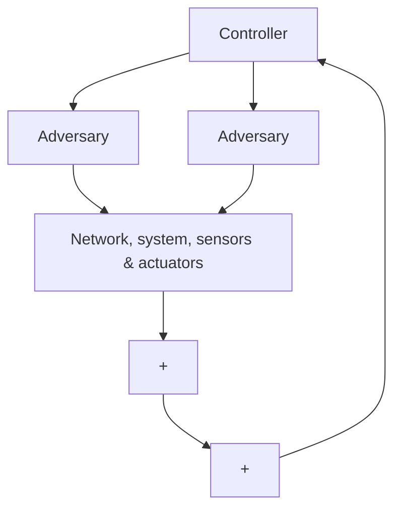

# 3.1 Approach

Let us consider the adversarial model represented in Figure 2. There is a controller getting data and sending control signals through networked sensors and actuators to a system. An adversary can intercept and tamper signals exchanged between the environment and controller, in both directions. Despite the perpetration of attacks, the controller may still have the ability to monitor and steer the system. This is possible using redundant sensors and actuators attack detection techniques. This topic has been addressed in related work36. Furthermore, we assume that:

1. the controller has options and can independently make choices,   
2. the adversaries have options and can independently make choices and   
3. the consequences of choices made by the controller, in conjunction with those made by adversaries, can be quantified, either by a penalty or a reward.

flowchart

Figure 2. Adversarial model.

To capture these three key assumptions, we use the Markov Decision Process (MDP) model37, 38. The controller is an agent evolving in a world comprising everything else, including the network, system and adversaries. At every step of its evolution, the agent makes a choice among a number of available actions, observes the outcome by sensing the state of the world and quantifies the quality of the decision with a numerical score, called reward. Several cyber-physical security and resilience issues lend themselves well to this way of seeing things.
