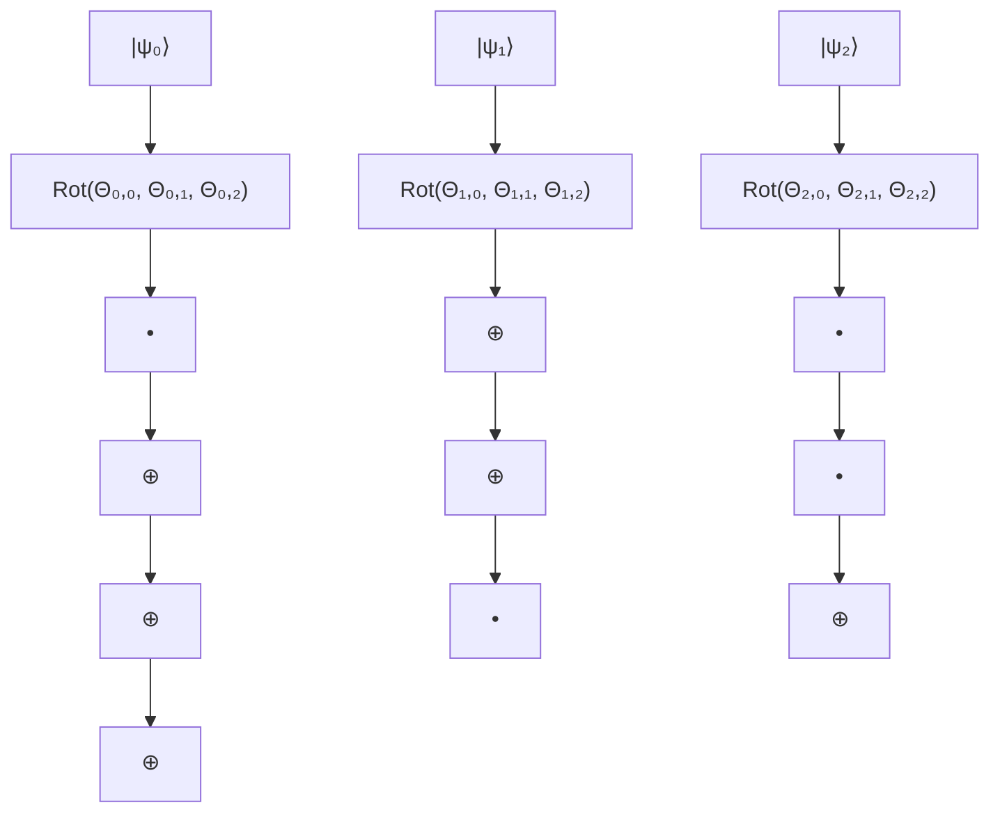

# 3.1.2 Quantum Reinforcement Learning

In this section we present our cyber-physical defense approach. A reader unfamiliar with quantum computing may first read Boxes 2 and 3, for a short introduction to the topic. At the heart of the approach is the concept of variational circuit. Bergholm et al.41 interpret such a circuit as the quantum implementation of a function $f ( \psi , \Theta ) : \mathbb { R } ^ { m } \to \mathbb { R } ^ { n }$ . That is, a two argument function from a dimension m real vector space to a dimension n real vector space, where m and n are two positive integers. The first argument ψ denotes an input quantum state to the variational circuit. The second argument Θ is the variable parameter of the variational circuit. Typically, it is a matrix of real numbers. During the training, the numbers in the matrix are progressively tuned, via optimization, such that the behavior of the variational circuit eventually approaches a target function. In our cases, this function is the optimal policy π, in the terminology of Q-learning (see Box 4).

flowchart

Figure 3. Three-qubit variational circuit layer W (Θ), where Θ is a three by three matrix of rotation angles.
