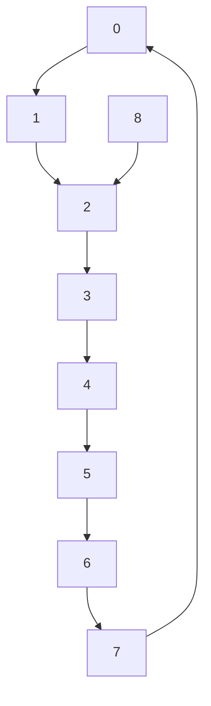
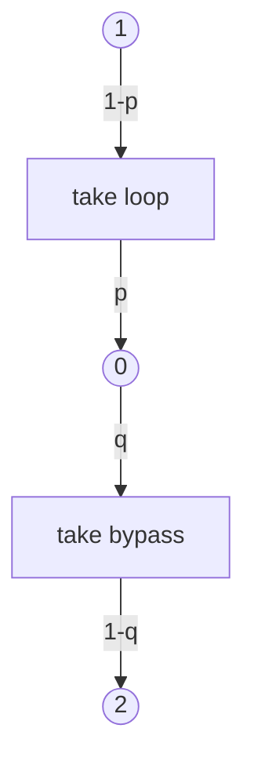

# 3.2.1 Agent and Its World

flowchart

(a) Configuration

flowchart

(b) MDP   
Figure 4. (a) Discrete two-train configuration. (b) MDP representation of the agent in its world. Circles represent states. Arrows represent action-triggered transitions.

Let us consider the discrete two-train configuration of Figure 4(a). Tracks are broken into sections. We assume a scenario where Train 1 is the agent and Train 2 is part of its world. There is an outer loop visiting points 3, 4 and 5, together with a bypass from point 2, visiting point 8 to point 6. Traversal time is uniform across sections. The normal trajectory of Train 1 is the outer loop, while maintaining a Train 2-Train 1 distance greater than one empty section. For example, if Train 1 is at point 0 while Train 2 is at point 7, then the separation distance constraint is violated. The goal of the adversary is to steer the system in a state where the separation distance constraint is violated. When a train crosses point 0, it has to make a choice: either traverse the outer loop or take the bypass. Both trains can follow any path and make independent choices, when they are at point 0.
