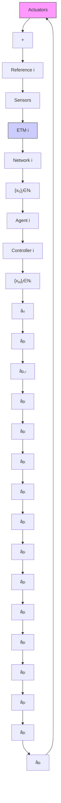

We denote $x _ { \mathrm { c } } : = ( x _ { \mathrm { c } } ^ { 1 } , \ldots , x _ { \mathrm { c } } ^ { N } ) \in \mathbb { R } ^ { n _ { \mathrm { c } } } , u : = ( u _ { 1 } , \ldots , u _ { N } ) \in$ $\mathbb { R } ^ { n _ { u } } , u _ { \mathrm { f } } : = ( u _ { \mathrm { f } } ^ { 1 } , \dots , u _ { \mathrm { f } } ^ { N } ) \in \mathbb { R } ^ { \bar { n } _ { u } } , u _ { \mathrm { c } } : = ( u _ { \mathrm { c } } ^ { 1 } , \dots , u _ { \mathrm { c } } ^ { N } ) \in \mathbb { R } ^ { n _ { u } }$ , $y _ { \mathsf { p } } : = ( y _ { \mathsf { p } } ^ { \mathrm { 1 } } , \ldots , y _ { \mathsf { p } } ^ { N } ) \in \mathbb { R } ^ { n _ { y } } , \mathrm { a n d } y _ { \mathsf { r } } : = ( y _ { \mathsf { r } } ^ { \mathrm { 1 } } , \ldots , y _ { \mathsf { r } } ^ { N } ) \in \mathbb { R } ^ { n _ { y } }$ $\begin{array} { r } { \hat { n _ { \mathrm { c } } } : = \sum _ { i = 1 } ^ { \hat { N } } n _ { \mathrm { c } } ^ { i } , n _ { u } : = \sum _ { i = 1 } ^ { N } n _ { u } ^ { i } } \end{array}$ $\begin{array} { r } { n _ { y } : = \sum _ { i = 1 } ^ { N } n _ { y } ^ { i } } \end{array}$

$$\dot {x} _ {\mathrm{p}} = f _ {\mathrm{p}} (x _ {\mathrm{p}}, u, w _ {\mathrm{p}}), \quad y _ {\mathrm{p}} = g _ {\mathrm{p}} (x _ {\mathrm{p}}), \tag {7}$$

flowchart

Fig. 1. Illustration of the information transmission in a single network. $\{ x _ { \mathrm { p } } ^ { j } \} _ { j \in \mathcal { N } _ { i } }$ is the set of states from the i-th agent’s neighbors, and $\{ x _ { \mathrm { r } } ^ { j } \} _ { j \in \mathcal { N } _ { i } }$ is the set of states from the i-th reference’s neighbors.

where $f _ { \mathfrak { p } } : = ( f _ { \mathfrak { p } } ^ { 1 } , \ldots , f _ { \mathfrak { p } } ^ { N } ) \in \mathbb { R } ^ { n _ { \mathfrak { p } } }$ and $g _ { \mathfrak { p } } : = ( g _ { \mathfrak { p } } ^ { 1 } , \dotsc , g _ { \mathfrak { p } } ^ { N } ) \in$ $\mathbb { R } ^ { n _ { y } }$ . Accordingly, the reference system is given by

$$\dot {x} _ {\mathrm{r}} = f _ {\mathrm{p}} (x _ {\mathrm{r}}, u _ {\mathrm{f}}, w _ {\mathrm{r}}), \quad y _ {\mathrm{r}} = g _ {\mathrm{p}} (x _ {\mathrm{r}}). \tag {8}$$
