# VI. EVENT-TRIGGERED OBSERVER DESIGN

In this section, we apply the obtained results in the previous sections to the event-triggered observer design for networked MAS in the delay-free case. Consider the following MAS

$$\dot {x} _ {\mathrm{p}} = f _ {\mathrm{p}} (x _ {\mathrm{p}}, w), \quad y _ {\mathrm{p}} = g _ {\mathrm{p}} (x _ {\mathrm{p}}), \tag {46}$$

where $x _ { \mathrm { p } } \in \mathbb { R } ^ { n _ { \mathrm { p } } }$ is the system state, $w \in \mathbb { R } ^ { n _ { w } }$ is the external disturbance, and $y _ { \mathsf { p } } \in \mathbb { R } ^ { n _ { y } }$ is the system output. The system (46) consists of N agents with the following form

$$\dot {x} _ {\mathrm{p}} ^ {i} = f _ {\mathrm{p}} ^ {i} (x _ {\mathrm{p}}, w), \quad y _ {\mathrm{p}} ^ {i} = g _ {\mathrm{p}} ^ {i} (x _ {\mathrm{p}} ^ {i}), \tag {47}$$

```mermaid
graph TD
    A["Agent 1"] -->|y_p^1| B["ETM 1"]
    B --> C["Network 1"]
    C --> D["Observer 1"]
    D --> E["y_o^1"]
    E --> F["ETM 2"]
    F --> G["Network 2"]
    G --> H["Observer 2"]
    H --> I["y_o^2"]
    I --> J["ETM N"]
    J --> K["Network N"]
    K --> L["Observer N"]
    L --> M["y_o^N"]
    M --> N["ETM N"]
    N --> O["Network N"]
    O --> P["Observer N"]
    P --> Q["y_o^N"]
    Q --> R["ETM N"]
    R --> S["Network N"]
    S --> T["Observer N"]
    T --> U["y_o^N"]
    U --> V["ETM N"]
    V --> W["Network N"]
    W --> X["Observer N"]
    X --> Y["y_o^N"]
    Y --> Z["ETM N"]
    Z --> AA["Network N"]
    AA --> AB["y_o^N"]
    AB --> AC["ETM N"]
    AC --> AD["Network N"]
    AD --> AE["Observer N"]
```

flowchart

Fig. 2. Configuration of the decoupled event-triggered observer design for networked MAS.

where $x _ { \mathrm { p } } : = ( x _ { \mathrm { p } } ^ { 1 } , \ldots , x _ { \mathrm { p } } ^ { N } ) \in \mathbb { R } ^ { n _ { \mathrm { p } } }$ , and $y _ { \mathbb { p } } : = ( y _ { \mathbb { p } } ^ { 1 } , \dots , y _ { \mathbb { p } } ^ { N } ) \in$ $\mathbb { R } ^ { n _ { y } }$ with $\begin{array} { r } { n _ { \mathrm { p } } : = \sum _ { i = 1 } ^ { N } n _ { \mathrm { p } } ^ { i } } \end{array}$ and $\begin{array} { r } { n _ { y } : = \sum _ { i = 1 } ^ { N } n _ { y } ^ { i } . } \end{array}$ 9s

To design the distributed event-triggered observers for the MAS (45), we consider the following two cases: the first case is that each observer only receives the information of the corresponding agent to estimate the state of this agent, and thus is called the decoupled observer design case; the second case is that multiple agents are treated as a whole plant as (45) and all observers only receive partial information and thus need to be coupled to construct the plant state, which is called the coupled observer design case.
