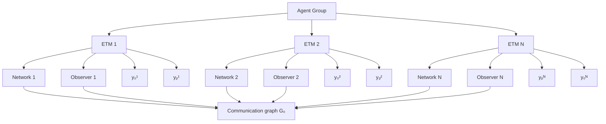

# B. Coupled Observer Design

In the coupled observer design case, each observer only receives partial information, and thus all observers need to exchange their information based on a pre-specified communication (di)graph [27], [31]. Assume that in the network-free case, the distributed observers for (46) are designed as

$$
\begin{array}{l} \dot {x} _ {\mathrm{o}} ^ {i} = f _ {\mathrm{p}} ^ {i} \left(x _ {\mathrm{o}} ^ {i}, 0\right) + \mathfrak {F} _ {i} \left(\vartheta_ {i}\right), \quad y _ {\mathrm{o}} ^ {i} = g _ {\mathrm{p}} ^ {i} \left(x _ {\mathrm{o}} ^ {i}\right), \tag {54} \\ \dot {\vartheta} _ {i} = \mathfrak {h} _ {i} (y _ {0} ^ {i}, \vartheta_ {i}). \\ \end{array}
$$

If the observer receives the latest information, the update is

$$x _ {\mathrm{o}} ^ {i +} = x _ {\mathrm{o}} ^ {i}, \quad \vartheta_ {i} ^ {+} = \Theta_ {i} (x _ {\mathrm{o}}, y _ {\mathrm{o}}, y _ {\mathrm{p}}), \tag {55}$$

flowchart

Fig. 3. Framework for the coupled distributed event-triggered state estimation for networked MAS.
