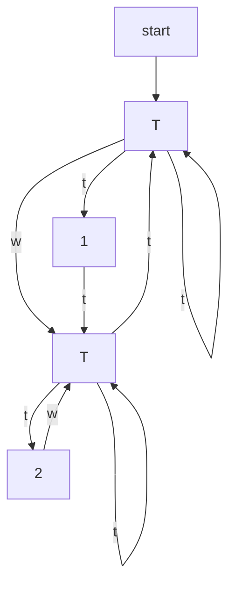

The outputs indicate either whether the system has just triggered (outputs $T _ { 1 }$ and ?? )) or the triggering deadline. Some states are given, for technical reasons, the distinct output $T _ { 1 }$ to capture that from those states the only action that can be taken is $\mathbf { \check { \Gamma } } _ { t } \mathbf { \dot { \Gamma } } _ { \mathrm { ~ ~ } }$ while on the other states with output $T _ { i } ( i > 1 )$ , both $\cdot _ { w } ,$ and $\cdot _ { t } ,$ actions are enabled. In this transition system, triggering after ?? samples becomes a sequence of $k - 1 \mathbf { \Omega } ^ { \ast } \mathbf { \boldsymbol { w } } ^ { \prime }$ actions followed by a single $\cdot _ { t } ,$ action.

flowchart

Figure 5: An example of wait-trigger model $\hat { s }$ for PETC traffic.

Next, all these transition systems (representing different PETC systems) are combined into a larger transition system, through a parallel composition allowing each subsystem to behave independently of the rest. Formally, the resulting composition is given by the transition system $S _ { c o m p . } = ( X _ { c o m p . } , X _ { c o m p . ; 0 } , { \mathcal U } _ { c o m p . } , { \mathcal E } _ { c o m p . }$ , $y _ { c o m p . } , H _ { c o m p . } )$ , where

• $\chi _ { c o m p . } : = \hat { X } _ { 0 } \times \cdot \cdot \cdot \times \hat { X } _ { n } ,$   
• $\chi _ { c o m p . ; 0 } : = \hat { X } _ { 0 ; 0 } \times \cdot \cdot \cdot \times \hat { X } _ { n ; 0 } ,$   
• $\mathcal { U } _ { c o m p . } : = \hat { \mathcal { U } } _ { 0 } \times \dots \times \hat { \mathcal { U } } _ { n } ,$   
$\begin{array} { r l } & { \bullet \mathscr { E } _ { c o m p . } : = \{ ( ( x _ { 0 } , \ldots , x _ { n } ) , ( u _ { 0 } , \ldots , u _ { n } ) , ( x _ { 0 } ^ { \prime } , \ldots , x _ { n } ^ { \prime } ) \mid \forall i \leq n , } \\ & { ( x _ { i } , u _ { i } , x _ { i } ^ { \prime } ) \in \hat { \mathscr { E } } _ { i } \} , } \end{array}$   
• $y _ { c o m p . } : = \hat { y } _ { 0 } \times \hdots \times \hat { y } _ { n } ,$   
$\bullet H _ { c o m p . } ( x _ { 0 } , . . . , x _ { n } ) : = ( \hat { H } _ { 0 } ( x _ { 0 } ) , . . . , \hat { H } _ { n } ( x _ { n } ) ) .$
