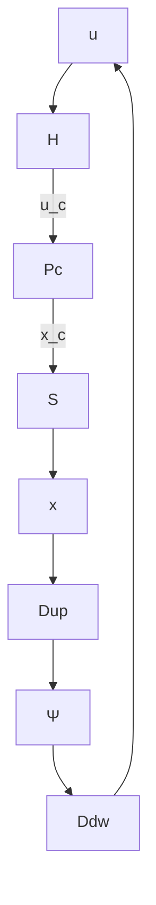

# I. INTRODUCTION

Communication delays are inevitable when transmitting signals via communication channels. Since the delays may affect performance of the networked control systems (NCSs), taking them into account in analysis and synthesis is one of the important issues in the field of NCSs [1], [2], [3]. The delays naturally become randomly time-varying when the Internet is used as the communication channels [4]. Hence, discrete-time stochastic processes $( \mathrm { i . e . }$ , random sequences) are more desirable as the model of communication delays than constants in practice.

The structure of the NCS to be dealt with in this paper is standard as in Fig. 1, where Pc, Ψ, S and H denote a continuous-time deterministic linear plant, a discrete-time state-feedback controller, the ideal sampler and the zeroorder hold, respectively. We denote this NCS by Σ. The solid (resp. dashed) arrows are used for continuous-time (resp. discrete-time) signals in the figure. The discrete-time signals are transmitted via communication channels, and the delay elements $D ^ { \mathrm { u p } }$ and $D ^ { \mathrm { d w } }$ are assumed to exist in the channels; those elements delay the arrival of signals by some random intervals (the details will be described later). The sampler and the hold are assumed to operate in synchronization, which implies that the sampling intervals are determined by the random delays; the sum of the two delays becomes the sampling interval at each sampling time instant. Hence, the arguments for stabilization of the NCS Σ can be interpreted as a stochastic version of the aperiodic control [5]. The purpose of this paper is to show a synthesisoriented inequality condition for state-feedback stabilization of this type of NCSs in the case that the delays (i.e., sampling intervals) are given by i.i.d. processes (i.e., discrete-time white processes).

flowchart

Fig. 1. Networked control system with random communication delays.
