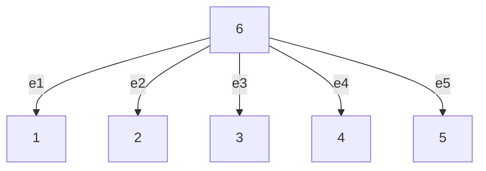

$$v _ {i} (t) = - \sum_ {k \in \Omega_ {i}} (\phi_ {k} (\hat {x} _ {k}, t)) ^ {2} \overline {{{x}}} _ {k}, i \in \mathcal {V}, t \in \mathbb {R} _ {0} ^ {+}. \tag {21}$$

If

$$L _ {e} - \frac {1}{2} k _ {g} ^ {2} I _ {m} > 0, \tag {22}$$

where $\mathsf { k } _ { g }$ is the Lipschitz constant of the diffusion term $g ( \cdot )$ in (1), then the controller in (21) achieves almost sure consensus for any initial relative position $\overline { { x } } _ { k } ( 0 ) \in$ $( - \rho _ { k } ( 0 ) , \rho _ { k } ( 0 ) ) , \ k \in [ 1 ; m ]$ while guaranteeing prescribed performance in (9) in the sense of qth moment, where $q \in \{ 1 , 2 \}$ .

Proof: Consider a Lyapunov-like function $V : \mathbb { R } ^ { 2 m } $ $\mathbb { R } _ { 0 } ^ { + }$ as

$$V (\eta) = \left(\frac {1}{q} \eta^ {T} \eta\right) ^ {\frac {q}{2}},$$

where $q \in \{ 1 , 2 \}$ . One can readily verify that the function V satisfies condition (6) with functions $\underline { { { \psi } } } ( s ) : = ( \textstyle { \frac { 1 } { q } } ) ^ { \frac { q } { 2 } } \varepsilon$ and $\overline { { \psi } } ( s ) : = ( \frac { 2 m } { q } ) ^ { \frac { q } { 2 } }$ s for all $s \in \mathbb { R } _ { 0 } ^ { + }$ . The corresponding infinitesimal generator as defined in (5) along the augmented dynamics (15) of the multi-agent system in edge space (13)

flowchart

Fig. 1. Communication graph with tree topology

and transformed error dynamics (14) is given by

$$
\begin{array}{l} \mathcal {L} V (\eta) = \eta^ {T} \Bigl (\frac {1}{q} \eta^ {T} \eta \Bigr) ^ {\frac {q}{2} - 1} \Bigl (\left[ \begin{array}{c c} - L _ {e} & 0 _ {m} \\ - \phi_ {t} (L _ {e} + \alpha_ {t}) & 0 _ {m} \end{array} \right] \eta \\ + \left[ \begin{array}{c} I _ {m} \\ \phi_ {t} \end{array} \right] D ^ {T} v \Big) + \frac {1}{2} G (x) ^ {T} D \left[ \begin{array}{c} I _ {m} \\ \Phi_ {t} \end{array} \right] ^ {T} \left(\left(\frac {1}{q} \eta^ {T} \eta\right) ^ {\frac {q}{2} - 1} I _ {2 m} \right. \\ \left. + \frac {q - 2}{q} \eta \eta^ {T} \Bigl (\frac {1}{q} \eta^ {T} \eta \Bigr) ^ {\frac {q}{2} - 2}\right) \left[ \begin{array}{c} I _ {m} \\ \phi_ {t} \end{array} \right] D ^ {T} G (x). \\ \end{array}
$$

The stack vector of external inputs is written as

$$v (t) = - D \Phi_ {t} ^ {2} \overline {{{x}}}, t \in \mathbb {R} _ {0} ^ {+}. \tag {23}$$
