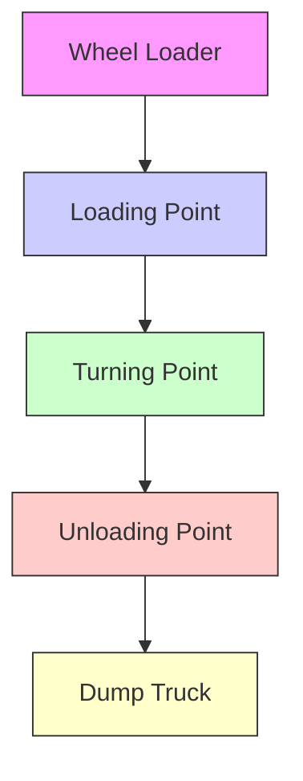

# 1 Introduction

Wheel loaders are often used to transport materials on mining and construction sites, as shown in Fig. 1. Currently, wheel loaders are mostly controlled by trained human operators. The prolonged training process leads to global labor shortages for operating heavy mining and construction equipment. Besides life-threatening incidents, human operators often have to operate the wheel loaders in extreme working conditions, such as heavy dust and extreme temperatures [1]. Moreover, the frequent acceleration, deceleration, and steering actions of wheel loaders pose considerable challenges to the wheel loader drivers, making it impossible to maintain high working efficiency and quality over long operation periods [2]. These issues stimulate the critical demands of autonomous systems equipped on wheel loaders and other articulated vehicles in extreme working conditions [3].

Wheel loaders consist of a front and rear body connected by a hinge joint and a swing ring. In the articulated steering process, the front and rear vehicle bodies are connected by the hydraulic actuators to steer the vehicle [4]. This mechanism reduces the turning radius and improves the maneuverability of the vehicle, which gives it good adaptability in various operating environments [5]. However, this steering mechanism introduces highly nonlinear dynamics, hence imposes extra complexity on the trajectory planning and tracking control problem.

flowchart

Figure 1: A typical loading cycle of the wheel loader.
