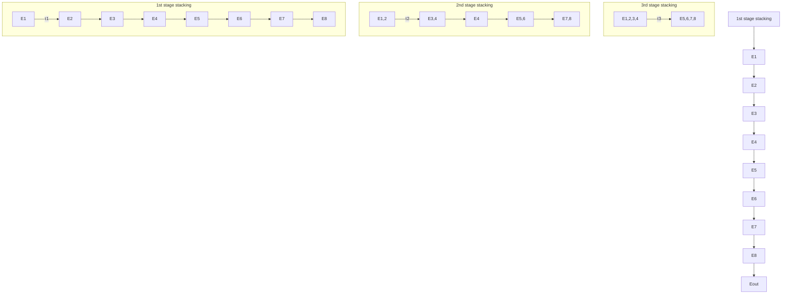

# 2.1 Physics of the simulation

The optical pulse stacking (OPS), also known as pulse combination, system employs a recursive approach to stack optical pulses in the time domain. The dynamics of the OPS are similar to the recurrent neural networks (RNN) or Wavenet architecture (Oord et al., 2016). We illustrate the dynamics of the OPS in RNN style as shown in Fig. 1. In the OPS system, the input consists of a periodic pulse train 1 with a repetition period of T . Assuming the basic function of the first pulse at time step t is denoted as $E _ { 1 } = E ( t )$ (a complex function), the subsequent pulses can be described as $E _ { 2 } = E ( t + T ) , E _ { 3 } = E ( t + 2 T )$ , and so on. The OPS system recursively imposes time delays to earlier pulses in consecutive pairs. For instance, in the first stage of OPS, a time-delay controller imposes the delay τ1 on pulse 1 to allow it to combine (overlap) with pulse 2. With the appropriate time delay, pulse 1 can be stacked with the next pulse, $E _ { 2 }$ , resulting in the stacked pulses $E _ { 1 , 2 } = E ( t + \tau _ { 1 } ) + E ( t + T )$ . Similarly, pulse 3 can be stacked with pulse 4, creating $E _ { 3 , 4 } = E ( t + 2 T + \tau _ { 1 } ) + E ( t + 3 T )$ , and so forth. In the second stage of OPS, an additional time delay, τ2, is imposed on $E _ { 1 , 2 }$ to allow it to stack with $E _ { 3 , 4 }$ , resulting in $E _ { 1 , 2 , 3 , 4 }$ . This stacking process continues in each subsequent stage of the OPS controller, multiplying the pulse energy by a factor of $2 ^ { N }$ by stacking $2 ^ { N }$ pulses, where N time delays $\left( \tau _ { 1 } , \tau _ { 2 } , . . . , \tau _ { N } \right)$ are required for control and stabilization. Additional details about the optical pulse stacking are shown in appendix A.1.

flowchart

Figure 1: Illustration of the principle of optical pulse stacking. Only 3-stage pulse stacking was plotted for simplicity.
