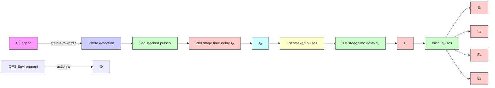

Figure 3: Illustration of the interaction between RL agent and OPS environment. Only 2-stage OPS was plotted for simplicity.

Action space. The action space of an N-stage OPS environment is a continuous and N-dimensional vector space. At each time step $t ,$ the action $a _ { t }$ corresponds to an additive time delay value $\Delta \tau ( t )$ for the N -stage OPS environment: $a _ { t } = \Delta \tau ( t ) = \tau ( t + 1 ) - \tau ( t )$ . The OPS environment applies the additive time delay value $a ( t )$ to transition to the next state.

Reward. As mentioned in section 2.2, the objective of the OPS controller is maximizing the final stacked pulse energy $P _ { N } ( \tau )$ . In our simulation, we use the normalized final pulse energy as the reward value. The reward at each time step is defined as:

$$r = - \frac {(P _ {N} (\tau) - P _ {m a x}) ^ {2}}{(P _ {m i n} - P _ {m a x}) ^ {2}}, \tag {3}$$

where $P _ { m a x }$ is the maximum pulse energy at the global optimum, and $P _ { m i n }$ is the minimum pulse energy. The maximum reward 0 achieved when $P ( \tau ) = P _ { m a x }$ (peak position of Fig. 2(b)) .

State transition function. The environmental noise has direct impacts on the delay lines, including the vibration and temperature-induced shift noise of the delay line devices. Therefore, in the state transition process, the actual applied delay line value $\tau _ { \mathrm { r e a l } } ( t + 1 )$ is a combination of the action $a _ { t }$ and the noise $e _ { t } .$ . Specifically, it can be expressed as:

$$\tau_ {\text { real }} (t + 1) = \tau_ {\text { real }} (t) + a _ {t} + e _ {t}. \tag {4}$$
