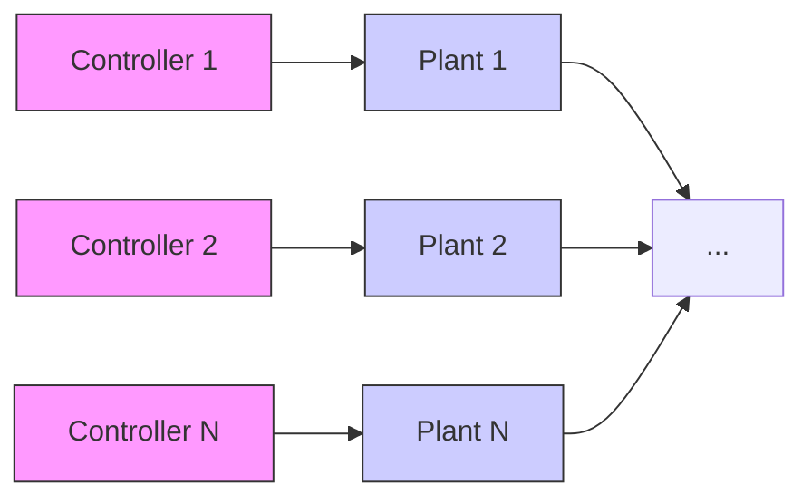

◦ We present an algorithm to design scheduling logics. At every instant of time, our algorithm allocates the shared network to subsets of the plants with certain probabilities. We present necessary and sufficient conditions on the plant dynamics and the capacity of the shared network under which a scheduling logic obtained from our algorithm ensures stochastic stability of each plant in the NCS.   
◦ Given plant dynamics and capacity of the shared network, we present an algorithm to design static state-feedback controllers such that the plants, their controllers and the shared network together satisfy our stability conditions.

flowchart

Figure 1. Block diagram of NCS

The proposed stability conditions are derived using a Markovian jump linear systems modelling of the individual plants. They involve matrix inequalities and can be verified by using standard matrix inequality solver toolboxes.

The remainder of this paper is organized as follows: In §2 we formulate the problem under consideration. Our results appear in $\ S 3 .$ . We also describe various features of our results in this section. Numerical experiments are presented in §4. We conclude in §5 with a brief discussion on future research direction.
