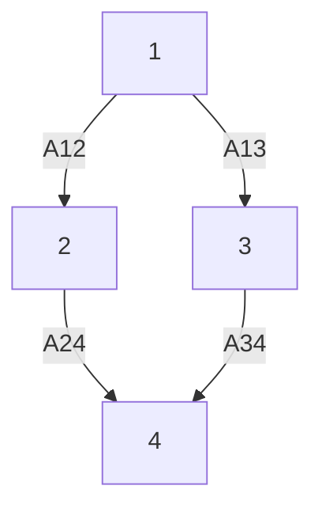

And then we transform the observability problem of system (5) into the controllability problem of system (6). It is important to note that system (6) and system (1) are in different forms due to the existence of coefficient matrix, so the controllability of system (6) needs to be discussed.

Lemma 5. $\pi = \left\{ V _ { 1 } , V _ { 2 } , \cdots , V _ { k } \right\}$ is an EP for matrix-weighted graph $G$ and $P _ { \pi }$ is the characteristic matrix. If the matrix

$$
Q ^ {*} = \left[ \begin{array}{c c c c} Q _ {1 *} & 0 & \dots & 0 \\ 0 & Q _ {1 *} & \dots & 0 \\ \vdots & \vdots & \ddots & \vdots \\ 0 & 0 & \dots & Q _ {1 *} \end{array} \right] - \left[ \begin{array}{c c c c} Q _ {1 1 *} & Q _ {1 2 *} & \dots & Q _ {1 s *} \\ Q _ {2 1 *} & Q _ {1 2 *} & \dots & Q _ {2 s *} \\ \vdots & \vdots & \ddots & \vdots \\ Q _ {n 1 *} & Q _ {n 2 *} & \dots & Q _ {n s *} \end{array} \right]
$$

exists, which means that there are matrices $Q _ { 1 * } , Q _ { i j }$ ∗ that make $A ^ { T } C = C Q _ { 1 } ,$ ∗ and $L _ { \pi i j } K ^ { T } B ^ { T } C = C Q _ { i j * } , ( 0 \leq i \leq$ $n , 0 \leq j \leq s )$ holds, then there is

$$\tilde {L} ^ {T} \tilde {P} _ {\pi} = \tilde {P} _ {\pi} Q ^ {*}$$

Furthermore 𝑖𝑚 $\left( { \tilde { P } } _ { \pi } \right)$ is 𝐿̃ − invariant.

PROOF. The proof process is similar to Lemma 2, and thus is omitted here.

Remark 12. Although Lemma 5 and Lemma 2 are similar in form, the restriction conditions of the coefficient matrix in the two cases are different, which is determined by the characteristics of the dual system.

flowchart

Figure 1: A matrix weighted signed graph with fixed topology including nontrival cell

  
（a）

  
Figure 2: A matrix weighted signed graph with switching topology

Theorem 6. Suppose that the matrix 𝑄∗ exists, then system (5) is unobservable if the matrix weighted network contains nontrivial cells

PROOF. Similar to Theorem 1 and Corollary 1, we can get from Lemma 5 that the system (6) is uncontrollable if it contains the nontrivial cell. According to the properties of dual systems, system (5) is unobservable.
