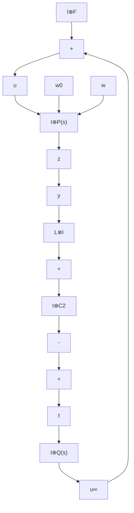

# A. Relative Output Feedback Case

In this subsection, we consider the case where only the relative output information of the neighboring agents is accessible to each agent. In this case, the structure of the proposed complementary design is depicted in Fig. 1.

flowchart

Fig. 1. The controller strucoutputs. In this structure, $\boldsymbol { v } ~ = ~ [ v _ { 1 } ^ { T } , \cdot \cdot \cdot ~ , v _ { N } ^ { T } ] ^ { T } , ~ \boldsymbol { \check { u } } _ { 2 } ~ = ~ [ u _ { 2 1 } ^ { T } , \cdot \cdot \cdot , u _ { 2 N } ^ { T } ] ^ { T }$ $\bar { u _ { \infty } } = [ u _ { \infty 1 } ^ { T } , \cdot \cdot \cdot , u _ { \infty n } ^ { T } ] ^ { T } , P ( s )$ N   denotes the agent dynamics in $( 2 ) , D O ( s )$ represents the distributed observer for each agent, with vi as the protocol state, $f ^ { ' } = [ f _ { 1 } ^ { T } , \cdots , f _ { N } ^ { T } ] ^ { T }$ is the residual signal, and . The rest variables are defi $Q ( s )$ is the extra controllers in Section III.

1) Step One: In the first step, we consider the H2 consensus problem for the case with nominal agent dynamics, i.e., we consider only the noise w0i (without considering external disturbances wi). Relying on the relative output information of neighboring agents, we employ the following distributed observer-based protocol [20], [2]:

$$\dot {v} _ {i} = (A - G C _ {2}) v _ {i} + \sum_ {j = 1} ^ {N} a _ {i j} \left(B _ {2} F \left(v _ {i} - v _ {j}\right) + G \left(y _ {i} - y _ {j}\right)\right), \tag {4a}u _ {2 i} = F v _ {i}, \quad i = 1, \dots , N, \tag {4b}$$

where $v _ { i } \in \mathbf { R } ^ { n }$ is the protocol state, $u _ { 2 i }$ is the input of the i-th agent in this step, F and G are the feedback gain matrices to be designed. The coefficient $a _ { i j }$ is the ij-th entry of the adjacency matrix of the communication graph among the agents.

Since in the this step, we only take care of the influence of the noise ${ w _ { 0 i } }$ on the performance outputs $z _ { i } ,$ , we consider only the outer loop in Fig. 1. The control input ui of agent i in this case is equal to $u _ { 2 i }$ , with $u _ { \infty i } = 0$ . Define the error variables

$$e _ {i} \triangleq v _ {i} - \sum_ {j = 1} ^ {N} a _ {i j} (x _ {i} - x _ {j}), \quad i = 1, \dots , N. \tag {5}$$

We then have
