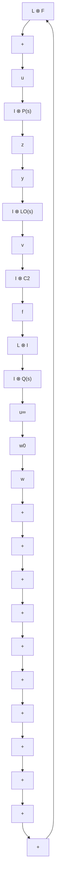

# B. Absolute Output Feedback Case

In this subsection, we consider the case where absolute output information of each agent is available. In this case, we adopt local observers for the agents, instead of the distributed observers as in the previous subsection. The structure of the complementary design approach in this case is depicted in Fig. 2.

1) Step One: Based on the absolute output $y _ { i } ,$ , we propose for each agent the following Luenberger observer:

$$\dot {\check {v}} _ {i} = A \check {v} _ {i} + B u _ {i} + \check {G} (y _ {i} - C _ {2} \check {v} _ {i}), \tag {32}$$

where $\breve { G }$ is the observer gain to be designed. In the first step, we consider only the outer loop, therefore, $u _ { i } ~ = ~ u _ { 2 i }$ . For the $H _ { 2 }$ consensus problem, we design the following protocol:

$$u _ {2 i} = \check {F} \sum_ {j = 1} ^ {N} a _ {i j} (\check {v} _ {i} - \check {v} _ {j}), \tag {33}$$

where $\breve { F }$ is the feedback gain to be designed. Denote $\begin{array} { r l } { \breve { v } _ { i } } & { { } = } \end{array}$ $[ \breve { v } _ { 1 } ^ { T } , \cdots , \breve { v } _ { N } ^ { T } ] ^ { T }$ and $\begin{array} { r } { \breve { \xi } ~ = ~ \left[ \breve { x } ^ { T } ~ \breve { v } ^ { T } \right] ^ { T } } \end{array}$ . The closed-loop network

flowchart

Fig. 2. The controller structure of the complementary approach based on absolute outputs, where $L O ( s )$ represents the local observer for each agent, f˜ is the residual signal, and $Q ( s )$ is the additional controller based on ${ \tilde { f } } ,$ and the rest of variables are defined as in Fig. 1.

dynamics in this case can be written in compact form as
