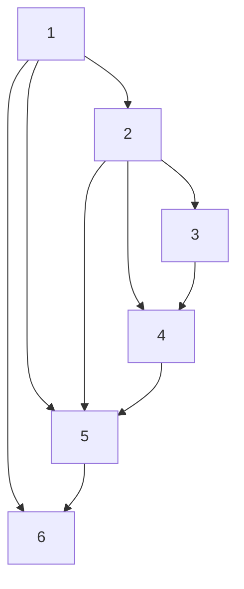

Let $\breve { e } _ { i } = \breve { v } _ { i } - x _ { i }$ . Denote $\breve { e } = [ \breve { e } _ { 1 } ^ { T } , \cdot \cdot \cdot , \breve { e } _ { N } ^ { T } ] ^ { T } , \breve { \zeta } = \left[ x ^ { T } \breve { e } _ { i } ^ { T } \right] ^ { T }$ and $\breve { n } = [ \breve { n } _ { 1 } ^ { T } , \cdot \cdot \cdot , \breve { n } _ { N } ^ { T } ] ^ { T }$ . Then, it follows from $( 2 ) , ( 3 3 )$ and (36) that the closed-loop network dynamics are given by

$$
\begin{array}{l} \left[ \begin{array}{c} \dot {\zeta} \\ \dot {\check {n}} \end{array} \right] = \left[ \begin{array}{c c} \breve {\mathcal {A}} + \mathcal {B} _ {2} \breve {\mathcal {D}} _ {c} \mathcal {C} _ {2} & \mathcal {B} _ {2} \breve {\mathcal {C}} _ {c} \\ \breve {\mathcal {B}} _ {c} \mathcal {C} _ {2} & \breve {\mathcal {A}} _ {c} \end{array} \right] \left[ \begin{array}{c} \breve {\zeta} \\ \breve {n} \end{array} \right] + \left[ \begin{array}{c} \breve {\mathcal {B}} _ {1} - \mathcal {B} _ {2} \breve {\mathcal {D}} _ {c} \breve {\mathcal {D}} _ {1} \\ - \breve {\mathcal {B}} _ {c} \breve {\mathcal {D}} _ {1} \end{array} \right] w, \\ z = \left[ \begin{array}{l l} \mathcal {C} _ {1} & 0 \end{array} \right] \left[ \begin{array}{l} \check {\zeta} \\ \check {n} \end{array} \right], \tag {37} \\ \end{array}
$$

flowchart

Fig. 3. The communication graph among the six agents.

line

| Time (s) | x₁,₁ | x₂,₁ | x₃,₁ | x₄,₁ | x₅,₁ | x₆,₁ |
| --- | --- | --- | --- | --- | --- | --- |
| 0 | -3.0 | 2.5 | 2.8 | 1.2 | 1.0 | 1.0 |
| 2 | 1.0 | 1.0 | 1.0 | 1.0 | 1.0 | 1.0 |
| 4 | 1.0 | 1.0 | 1.0 | 1.0 | 1.0 | 1.0 |
| 6 | 1.0 | 1.0 | 1.0 | 1.0 | 1.0 | 1.0 |
| 8 | 1.0 | 1.0 | 1.0 | 1.0 | 1.0 | 1.0 |
| 10 | 1.0 | 1.0 | 1.0 | 1.0 | 1.0 | 1.0 |
| 12 | 1.0 | 1.0 | 1.0 | 1.0 | 1.0 | 1.0 |
| 14 | 1.0 | 1.0 | 1.0 | 1.0 | 1.0 | 1.0 |
| 16 | 1.0 | 1.0 | 1.0 | 1.0 | 1.0 | 1.0 |
| 18 | 1.0 | 1.0 | 1.0 | 1.0 | 1.0 | 1.0 |
| 20 | 1.0 | 1.0 | 1.0 | 1.0 | 1.0 | 1.0 |

line

