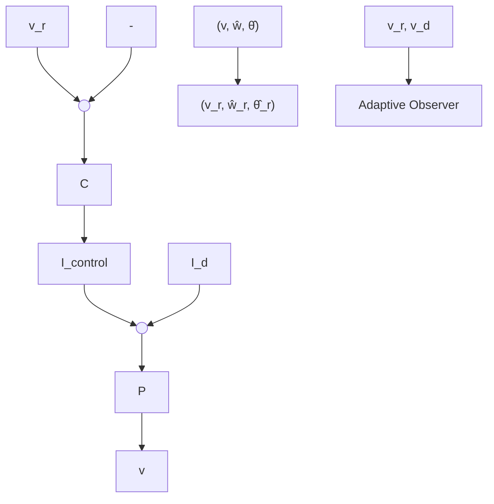

# 4. Model Reference Adaptive Conductance Control

Adaptive observers are instrumental to the classical design approach called model reference adaptive control (MRAC) [10]. In this section we illustrate the application of model reference adaptive control to conductance-based models. We regard a single neuron as a voltage-controlled circuit. We review the two canonical control problems of adaptive control: the adaptive tracking of a reference signal $v _ { r }$ (Section 4.1), and the adaptive disturbance rejection of an external current $I _ { d }$ (Section 4.2). We then illustrate the relevance of those elementary control problems in a network example (Section 4.3). See Figure 3 for a block diagram representation of the two problems.

flowchart

Figure 3: Block diagram representation of the adaptive reference tracking and disturbance rejection problems. Adapted from [10, Chapter 1].
