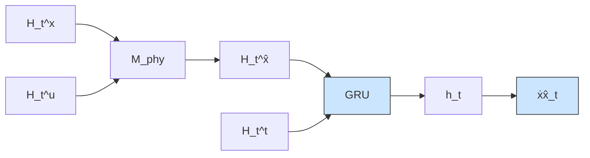

$$\dot {\hat {\boldsymbol {x}}} _ {t} = \widehat {\mathcal {F}} \left(\mathcal {H} _ {t} ^ {\hat {\boldsymbol {x}}}, \mathcal {H} _ {t} ^ {\boldsymbol {u}}, \mathcal {H} _ {t} ^ {t}, \mathcal {H} _ {t} ^ {\dot {\hat {\boldsymbol {x}}}}; \boldsymbol {\theta}\right),\hat {\boldsymbol {y}} = \widehat {\boldsymbol {\mathcal {G}}} \left(\mathcal {H} _ {t} ^ {\hat {\boldsymbol {x}}}, \mathcal {H} _ {t} ^ {\boldsymbol {u}}, \mathcal {H} _ {t} ^ {t}, \mathcal {H} _ {t} ^ {\tilde {\boldsymbol {y}}}; \boldsymbol {\theta}\right), \tag {8}\widehat {\mathcal {F}}: \hat {\mathbb {X}} ^ {N _ {t}} \times \mathbb {U} ^ {N _ {t}} \times \mathbb {T} ^ {N _ {t}} \times \tilde {\mathbb {X}} ^ {N _ {t}} \mapsto \hat {\mathbb {X}},\widehat {\boldsymbol {\mathcal {G}}}: \hat {\mathbb {X}} ^ {N _ {t}} \times \mathbb {U} ^ {N _ {t}} \times \mathbb {T} ^ {N _ {t}} \times \mathbb {Y} ^ {N _ {t}} \mapsto \mathbb {Y},$$

where $\mathcal { H } _ { t } ^ { \dot { \tilde { \mathbf { x } } } } : = \dot { \tilde { \mathbf { x } } } _ { t _ { 0 } } , \dots , \dot { \tilde { \mathbf { x } } } _ { t }$ and $\mathcal { H } _ { t } ^ { \tilde { \pmb { y } } } : = \tilde { \pmb { y } } _ { t _ { 0 } } , \ldots , \tilde { \pmb { y } } _ { t }$ denote the physics-based dynamics and output histories, respectively. The RNNs are trained to model target dynamics ${ \dot { \mathbf { x } } } _ { t }$ and outputs $\pmb { y } _ { t }$ by transforming physics-based information in a data-driven fashion to enhance the accuracy of predictions and lower training requirements. Therefore, in analogy to Jia et al. (2020), the model is called a Physics-Guided Recurrent Neural Network. Note that we are considering the controlled case here, i.e., augmented with $\mathcal { H } _ { t } ^ { u }$ .

flowchart

Fig. 1. Two interpretations of the PGRNN, either (a)MP GRNN or (b) MP GRNN

By shifting the model’s boundaries $( { \mathrm { F i g . ~ } } 1 )$ , the physicsbased model $\mathcal { M } _ { p h y }$ can be embedded within the PGRNN, yielding MP GRNN :
