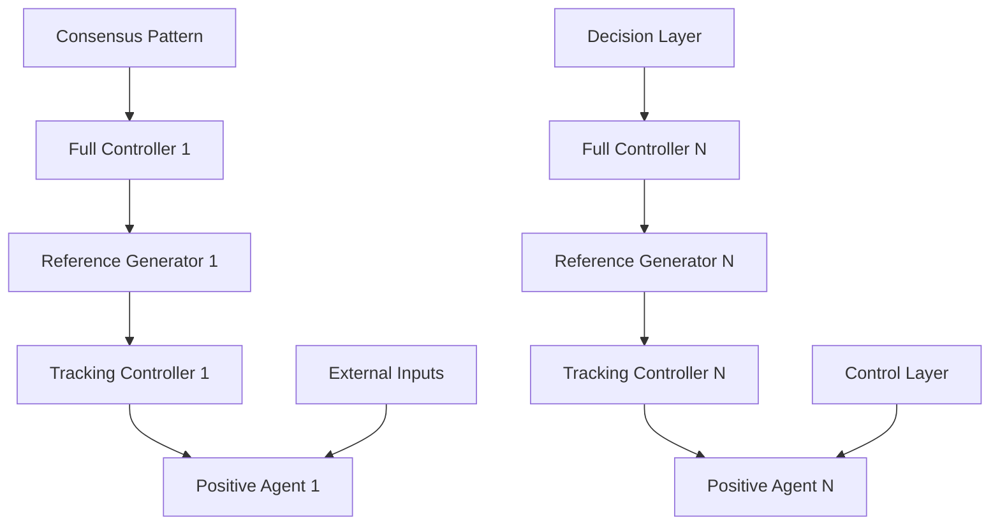

1) The trajectory of $x _ { i } ( t )$ is always nonnegative, i.e., $x _ { i } ( t ) \geq \mathbf { 0 }$ for any $t \geq 0$ .   
2) It internally achieves a patterned consensus specified by system (3). That is, there exists a positive constant $x _ { 0 0 } \in \mathbb { R } _ { + } ^ { n _ { 0 } }$ such that, $e _ { i } ( t ) \triangleq y _ { i } ( t ) - y _ { 0 } ( t )$ converges to 0 as $t \to \infty$ with $y _ { 0 } ( t ) = C _ { 0 } x _ { 0 } ( t )$ and $x _ { 0 } ( t )$ the corresponding trajectory of (3) starting from $x _ { 0 } ( 0 ) = x _ { 0 0 }$ .   
3) The influence of external inputs is attenuated such that the following inequality

$$\int_ {0} ^ {\infty} \| e _ {i} (s) \| ^ {2} \mathrm{d} s \leq \gamma^ {2} \int_ {0} ^ {\infty} \| d (s) \| ^ {2} \mathrm{d} s + \kappa$$

holds for some positive constant κ.

The formulated problem has been partially discussed in the literature for standard nonpositive multiagent systems under the name of output consensus or synchronization in [1, 29, 30]. Some recent attempts have been made in extending them to positive multi-agent systems assuming $A _ { 0 } = \mathbf { 0 } [ 1 7 , 1 8 , 2 0 , 2 3 ]$ . However, the obtained positive consensus results often require all agents share an identical high-order dynamics. Here, we consider heterogeneous agent dynamics subject to external inputs and aim to ensure a nontrivial pattern consensus and states’ positivity simultaneously.

flowchart

Figure 1: Illustration of two-step design scheme.

Before the main results, we make several extra assumptions to ensure the solvability of our problem as follows.

Assumption 1 Matrix $A _ { 0 }$ is Metzler with no eigenvalues having negative real parts.

Assumption 2 Each graph $\mathcal { G } _ { p }$ is connected.

Assumption 3 For each $i = 1 , 2 , \ldots , N _ { \mathrm { { \scriptsize ~ ; ~ } } }$ , there exist constant matrices $X _ { i } \in \mathbb { R } _ { + } ^ { n _ { i } \times n _ { 0 } }$ and $U _ { i } \in \mathbb { R } _ { + } ^ { 1 \times n _ { i } }$ such that
