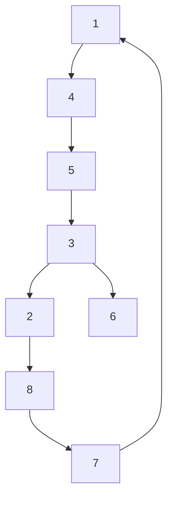
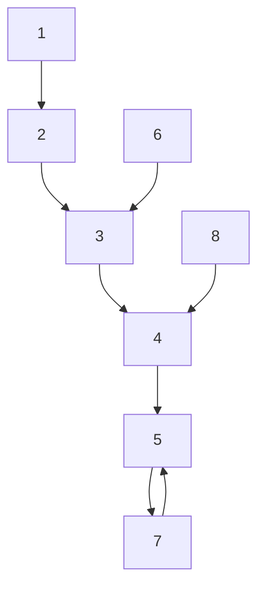

(a) G1

flowchart

(b) G2   
Figure 2: The communication graphs in our example.

Using the fact that $V _ { i } ( t ) \geq 0$ for any t, we have

$$\int_ {0} ^ {\infty} \| e _ {i} (s) \| ^ {2} \mathrm{d} s \leq \int_ {0} ^ {\infty} \gamma^ {2} \| d (s) \| ^ {2} \mathrm{d} s + V _ {i} (0)$$

The proof is thus complete.

Remark 1 Compared with most existing positive consensus results [18, 20–23], we present a two-step design scheme to solve the problem. Although the controller (16), particularly the local reference part, reduces to the observer-based type of control laws as that in [22, 23], we are able to handle heterogeneous positive multi-agent systems whose dynamics can be different from each other in both system matrices and orders over switching communication topologies. Moreover, the expected consensus trajectory of the multi-agent system is allowed to be of a more general prespecified pattern including nonnegative static consensus in [23] as a special case.

Remark 2 It is interesting to remark that the presented algorithms are mainly built upon several matrix inequalities, which can be taken as positive counterparts of γ-suboptimal $\mathcal { H } _ { \infty }$ design for similar problems [25, 26]. In practice, we can convert them to linear ones and then solve them using standard numerical softwares.
