The IM described in stationary reference frame interms of stator currents and Rotor Fluxes are as follows which was described in Reference[6] is designed as follows in the Figure 3.4

```mermaid
graph TD
    A["1 V-ds"] --> B["1 den(s)"]
    B --> C["+"]
    C --> D["Lm.s den(s)"]
    D --> E["×"]
    E --> F["Lr"]
    F --> G["×"]
    G --> H["Lr.s+Rr"]
    H --> I["1 Lr.s+Rr"]
    I --> J["×"]
    J --> K["Lm'Rr"]
    K --> L["×"]
    L --> M["Lr.s+Rr"]
    M --> N["×"]
    N --> O["Lm'Rr"]
    O --> P["×"]
    P --> Q["Lm'Rr"]
    Q --> R["×"]
    R --> S["Lm'Rr"]
    S --> T["×"]
    T --> U["Lm'Rr"]
    U --> V["×"]
    V --> W["Lm'Rr"]
    W --> X["×"]
    X --> Y["Lm'Rr"]
    Y --> Z["×"]
    Z --> AA["Lm'Rr"]
    AA --> AB["×"]
    AB --> AC["Lm'Rr"]
    AC --> AD["×"]
    AD --> AE["Lm'Rr"]
    AE --> AF["×"]
    AF --> AG["Lm'Rr"]
    AG --> AH["×"]
    AH --> AI["Lm'Rr"]
    AI --> AJ["×"]
    AJ --> AK["Lm'Rr"]
    AK --> AL["×"]
    AL --> AM["Lm'Rr"]
    AM --> AN["×"]
    AN --> AO["Lm'Rr"]
    AO --> AP["×"]
    AP --> AQ["Lm'Rr"]
    AQ --> AR["×"]
    AR --> AS["Lm'Rr"]
    AS --> AT["×"]
    AT --> AU["Lm'Rr"]
    AU --> AV["×"]
    AV --> AW["Lm'Rr"]
    AW --> AX["×"]
    AX --> AY["Lm'Rr"]
    AY --> AZ["×"]
    AZ --> BA["Lm'Rr"]
    BA --> BB["×"]
    BB --> BC["Lm'Rr"]
    BC --> BD["×"]
    BD --> BE["Lm'Rr"]
    BE --> BF["×"]
    BF --> BG["Lm'Rr"]
    BG --> BH["×"]
    BH --> BI["Lm'Rr"]
    BI --> BJ["×"]
    BJ --> BK["Lm'Rr"]
    BK --> BL["×"]
    BL --> BM["Lm'Rr"]
    BM --> BN["×"]
    BN --> BO["Lm'Rr"]
    BO --> BP["×"]
    BP --> BQ["Lm'Rr"]
    BQ --> BR["×"]
    BR --> BS["Lm'Rr"]
    BS --> BT["×"]
    BT --> BU["Lm'Rr"]
    BU --> BV["×"]
    BV --> BW["Lm'Rr"]
    BW --> BX["×"]
    BX --> BY["Lm'Rr"]
    BY --> BZ["×"]
    BZ --> CA["Lm'Rr"]
    CA --> CB["×"]
    CB --> CC["Lm'Rr"]
```

flowchart

Figure 3.4 Induction Motor Simulation Diagram
