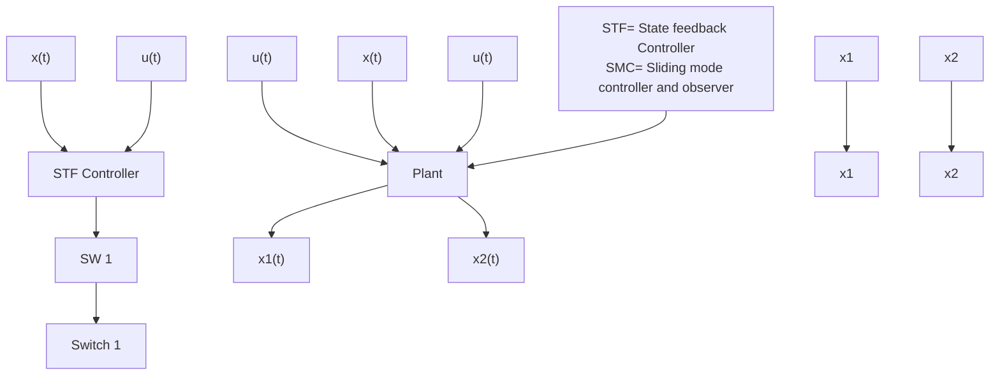

# IV. ADAPTIVE SLIDING MODE OBSERVER (ASMO):

The ability to generate a sliding motion on the error between the measured plant output and the output of the observer ensures that a sliding mode observer produces a set of states. Estimates that are precisely comparable with the actual output of the plant. Standard Testing function (Plant) along with Adaptive SMO is as shown in the below figure 4.1

flowchart

Fig. 4.1 Block diagram of ASMO
