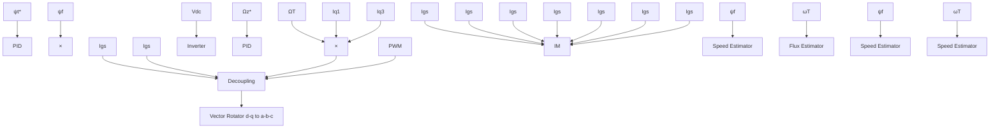

(c)Unstable (saddle)   
Fig 5.1. State Trajectories to identify the type of stability

Block Diagram representation of Induction Motor along with the State Estimators( Flux and Speed Estimators) along with PID tuners is as represented as follows in figure 5.2

flowchart

Fig 5.2 Block Diagram of Induction Motor along with Estimators

Simulation Diagram of DSFOC Induction Motor without ASMO is as shown in the below figure 5.3

flowchart

