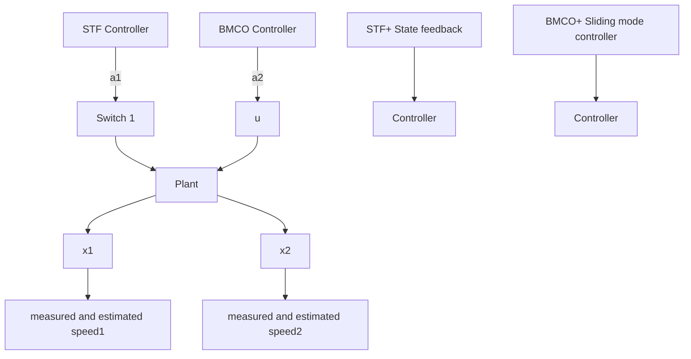

```mermaid
graph TD
    A["Input Signals"] --> B["6 HEuristic Transformations"]
    B --> C["Measurement"]
    C --> D["Inverter + noise"]
    D --> E["load torque"]
    E --> F["ampere_rst"]
    F --> G["ampere_rst"]
    G --> H["ampere_rst"]
    H --> I["ampere_rst"]
    I --> J["ampere_rst"]
    J --> K["ampere_rst"]
    K --> L["ampere_rst"]
    L --> M["ampere_rst"]
    M --> N["ampere_rst"]
    N --> O["ampere_rst"]
    O --> P["ampere_rst"]
    P --> Q["ampere_rst"]
    Q --> R["ampere_rst"]
    R --> S["ampere_rst"]
    S --> T["ampere_rst"]
    T --> U["ampere_rst"]
    U --> V["ampere_rst"]
    V --> W["ampere_rst"]
    W --> X["ampere_rst"]
    X --> Y["ampere_rst"]
    Y --> Z["ampere_rst"]
    Z --> AA["ampere_rst"]
    AA --> AB["ampere_rst"]
    AB --> AC["ampere_rst"]
    AC --> AD["ampere_rst"]
    AD --> AE["ampere_rst"]
    AE --> AF["ampere_rst"]
    AF --> AG["ampere_rst"]
    AG --> AH["ampere_rst"]
    AH --> AI["ampere_rst"]
    AI --> AJ["ampere_rst"]
    AJ --> AK["ampere_rst"]
    AK --> AL["ampere_rst"]
    AL --> AM["ampere_rst"]
    AM --> AN["ampere_rst"]
    AN --> AO["ampere_rst"]
    AO --> AP["ampere_rst"]
    AP --> AQ["ampere_rst"]
    AQ --> AR["ampere_rst"]
    AR --> AS["ampere_rst"]
    AS --> AT["ampere_rst"]
    AT --> AU["ampere_rst"]
    AU --> AV["ampere_rst"]
    AV --> AW["ampere_rst"]
    AW --> AX["ampere_rst"]
    AX --> AY["ampere_rst"]
    AY --> AZ["ampere_rst"]
    AZ --> BA["ampere_rst"]
    BA --> BB["ampere_rst"]
    BB --> BC["ampere_rst"]
    BC --> BD["ampere_rst"]
    BD --> BE["ampere_rst"]
    BE --> BF["ampere_rst"]
    BF --> BG["ampere_rst"]
    BG --> BH["ampere_rst"]
    BH --> BI["ampere_rst"]
    BI --> BJ["ampere_rst"]
    BJ --> BK["ampere_rst"]
    BK --> BL["ampere_rst"]
    BL --> BM["ampere_rst"]
    BM --> BN["ampere_rst"]
    BN --> BO["ampere_rst"]
    BO --> BP["ampere_rst"]
    BP --> BQ["ampere_rst"]
    BQ --> BR["ampere_rst"]
    BR --> BS["ampere_rst"]
    BS --> BT["ampere_rst"]
    BT --> BU["ampere_rst"]
    BU --> BV["ampere_rst"]
    BV --> BW["ampere_rst"]
    BW --> BX["ampere_rst"]
    BX --> BY["ampere_rst"]
    BY --> BZ["ampere_rst"]
```

flowchart

```mermaid
graph TD
    A["STF Controller"] -->|a1| B["Switch 1"]
    C["BMCO Controller"] -->|a2| D["u"]
    B --> E["Plant"]
    D --> E
    E --> F["x1"]
    E --> G["x2"]
    F --> H["measured and estimated speed1"]
    G --> I["measured and estimated speed2"]
    J["STF+ State feedback"] --> K["Controller"]
    L["BMCO+ Sliding mode controller"] --> M["Controller"]
```

Fig 5.3 Simulation Diagram of DSFOC Induction Motor without ASMO
