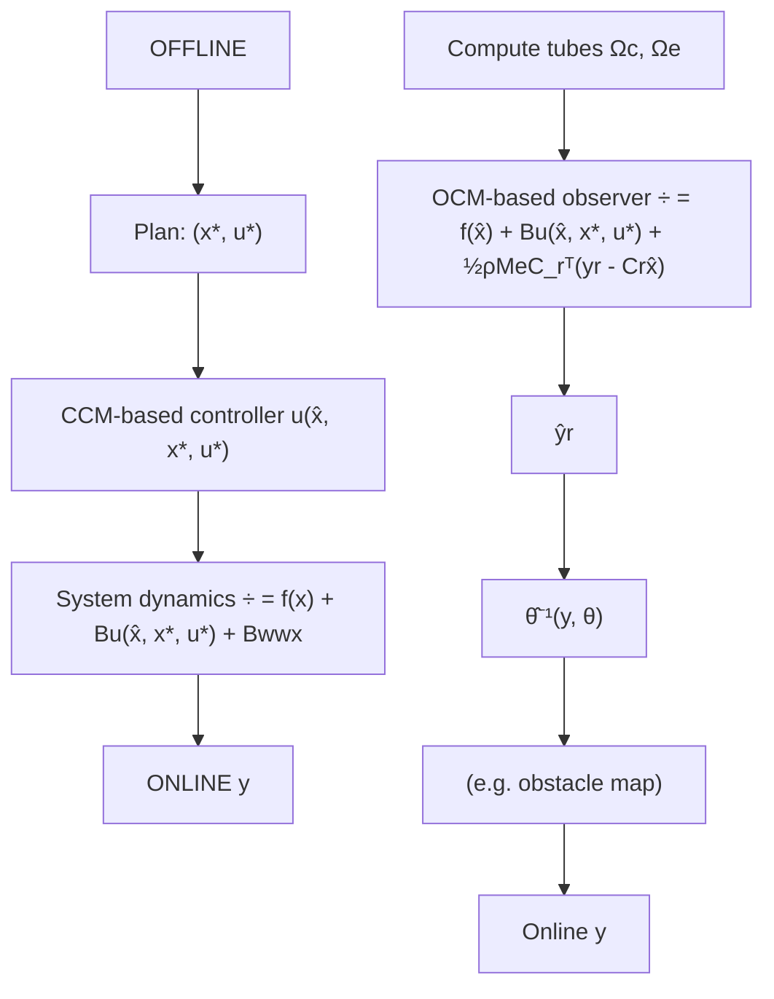

# 4 Method

flowchart

Fig. 2. Our method. Offline: After learning a perception system $\hat { h } ^ { - 1 } ( \mathrm { S e c . } 4 . 1 )$ , we bound its error to derive tracking tubes under imperfect perception (Sec. 4.2). We use these tubes to find safelytrackable plans (Sec. 4.4). Online: We design a CCM/OCM-based controller/observer (Sec. 4.3) to track the plan/perform state estimation at runtime, using $\hat { h } ^ { - 1 }$ to process rich observations y.

We describe our solution to the OFMP (cf. Fig. 2). Using dataset S, we first train a perception system that returns a reduced-order observation that simplifies the search for the contraction metrics (Sec. 4.1). Second, we bound the error of the learned perception module, and propagate this perception error bound through the system to derive bounds on the tracking and estimation error when using a CCM-/OCM-based controller/estimator (Sec. 4.2). Third, we obtain a CCM and OCM which optimizes this bound via SoS programming (Sec. 4.3). Finally, we use these bounds to constrain a planner to return trajectories that enable safe runtime tracking and robust goal reachability from observations (Sec. 4.4). For space, all proofs for the theoretical results are in App. C.
