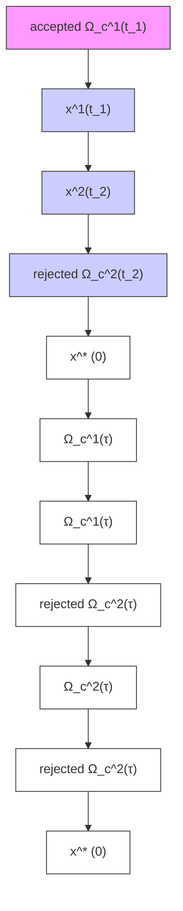

13 if $\exists t, \Omega_{c}^{n}(t) \subseteq G$ then break; return plan // return if in G

To use the Riemannian distance bounds $\bar { d } _ { c } ( t )$ and $\bar { d } _ { e } ( t )$ from (20) in planning, recall that these bounds define sets centered around $x ^ { * } ( t )$ and $x ( t ) , \varOmega _ { c } ( t )$ and $\varOmega _ { e } ( t )$ , which x and xˆ are guaranteed to remain within. We can use these sets for collision and constraint checking. If the metric defining Ω(t) is constant, each

flowchart

Fig. 5. Visualization of Alg. 1.
