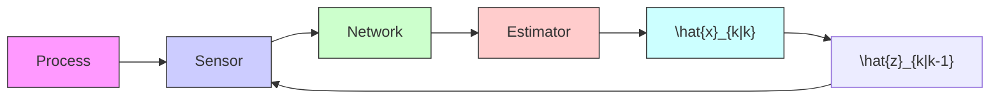

X. Lv, P. Duan and Z. Duan are with the State Key Laboratory for Turbulence and Complex Systems, Department of Mechanics and Engineering Science, College of Engineering, Peking University, Beijing 100871, China. E-mails: lvxx@pku.edu.cn (X. Lv), duanpeihu@pku.edu.cn (P. Duan), duanzs@pku.edu.cn (Z. Duan).   
G. Chen is with Department of Electrical Engineering, City University of Hong Kong, Hong Kong SAR, China. E-mail: eegchen@cityu.edu.hk (G. Chen).   
L. Shi is with Department of Electronic and Computer Engineering, the Hong Kong University of Science and Technology, Clear Water Bay, Kowloon, Hong Kong, China. E-mail: eesling@ust.hk (L. Shi)

flowchart

Fig. 1. Event-triggered sensor scheduling framework.
