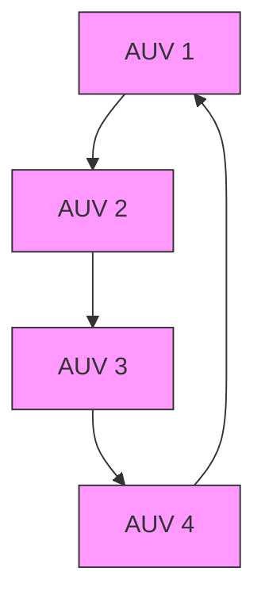

The parameters of sliding model controller are chosen as $k _ { 1 } ~ =$ diag {10, 10, 10, 10}, β0 = diag {100, 100, 100, 100}, and the bioinspired controller’s parameters are selected as $\begin{array} { r l } { A _ { s } } & { { } = } \end{array}$ diag {100, 100, 100, 100}, Bs = diag {30, 30, 30, 30}, $D _ { s } =$ diag {30, 30, 30, 30}, k1 = diag {10, 10, 10, 10} and $\beta _ { 0 } ~ =$ diag {10, 10, 10, 10}.
It is worth noting that considering the practical saturation issue that quite often occurs in real-world actuators, the amplitudes of controller’s outputs are artificially confined into the interval [−300, 300].
Moreover, because of the high-frequency switching nature of the conventional sliding mode control that makes the control signals oscillate extremely fast, to moderate this phenomenon saturation functions are used in simulation to take place of the sign functions that were employed in foregoing derivation of SMC controller.

flowchart

Fig. 2. The communication topology graph for 4 AUVs formation control.
